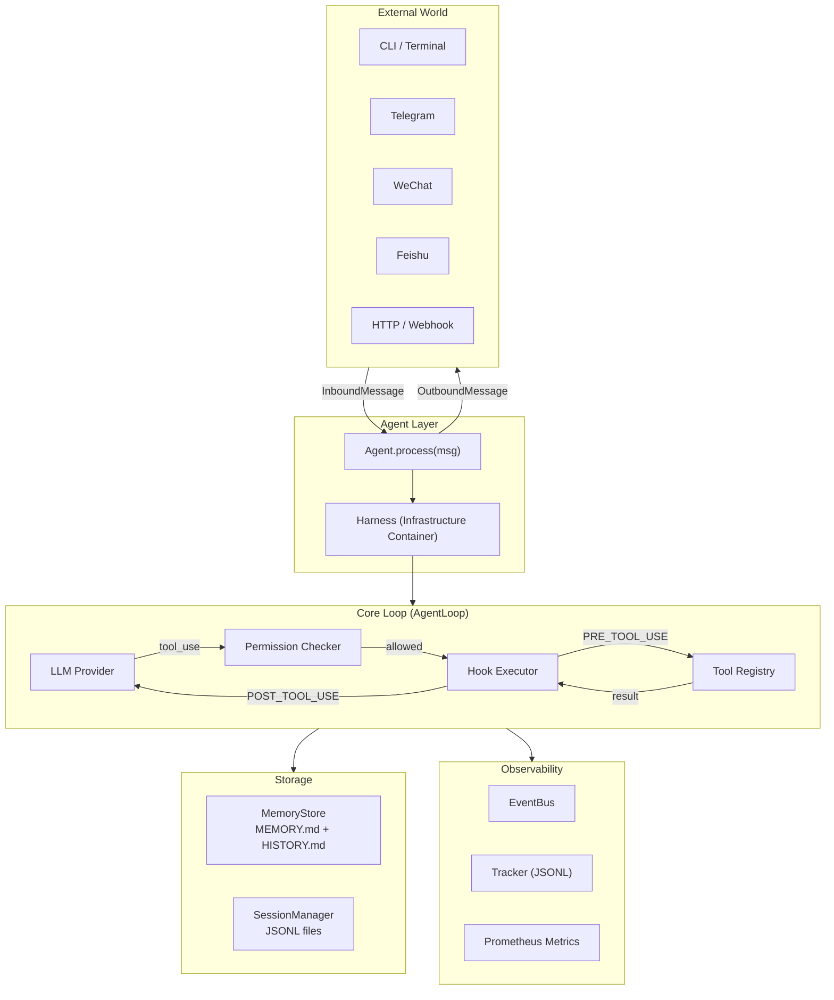
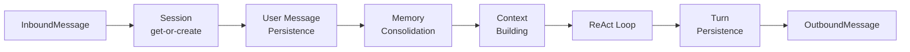
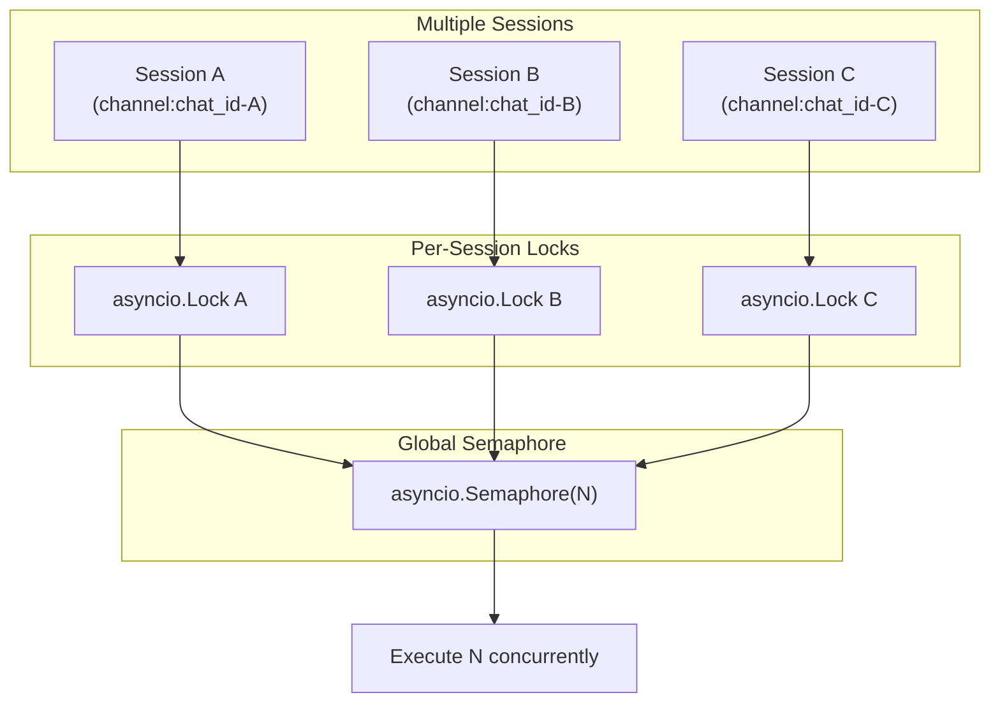
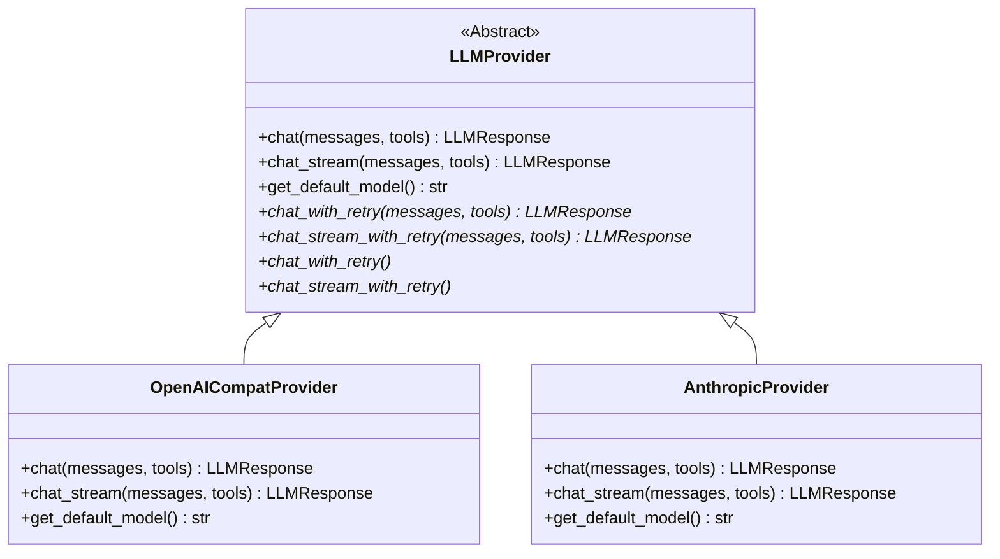
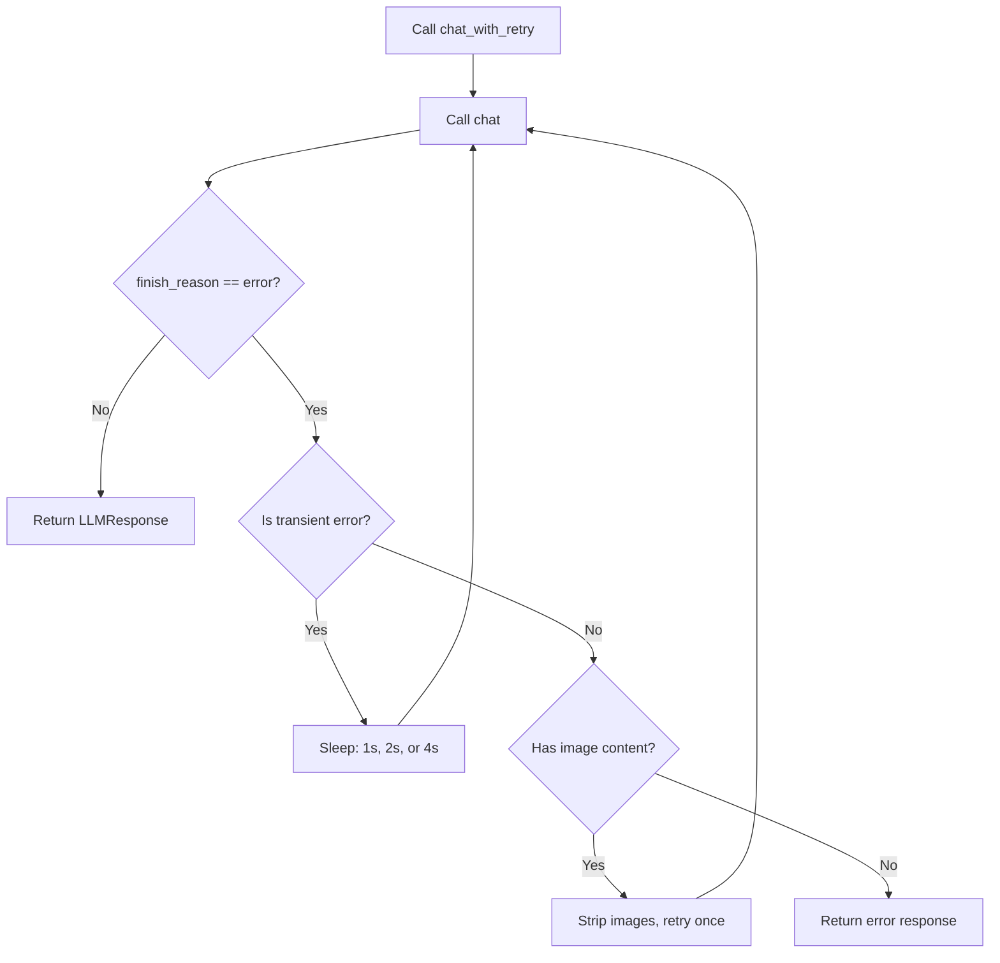
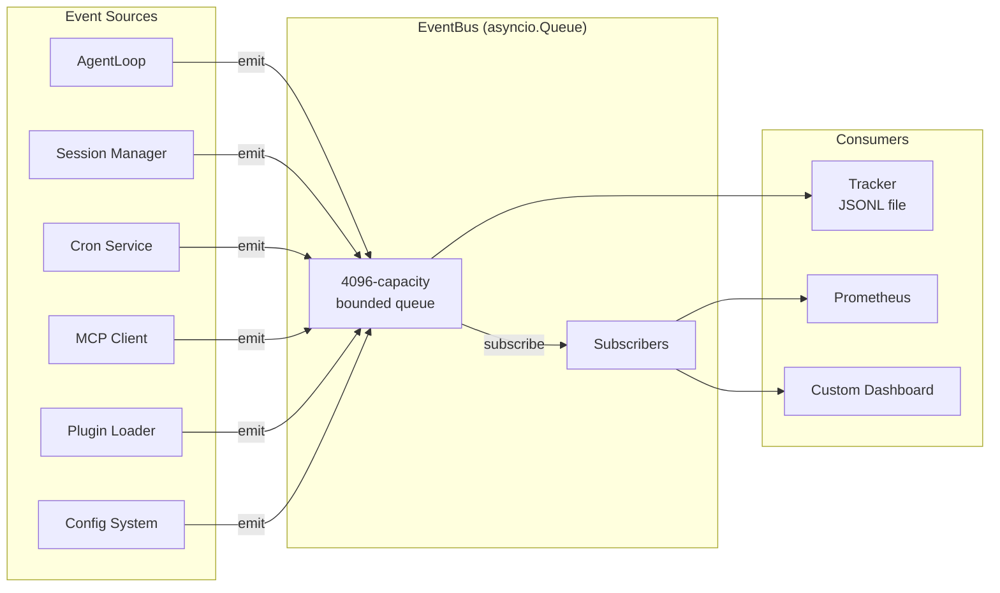

# Architecture

llm-harness is a production-grade reusable AI agent infrastructure base. This document describes its architecture in detail — how the pieces fit together, the design decisions behind them, and how it compares to alternatives.

---

## High-Level Architecture



---

## Design Principles

### Callback Injection

The core loop (`AgentLoop`) is a pure ReAct skeleton. Every piece of application-specific behavior is injected via `LoopCallbacks`:

```python
@dataclass
class LoopCallbacks:
    build_messages: Callable           # Assemble the LLM message list
    execute_tool: Callable             # Run a tool by name + args
    get_tool_definitions: Callable     # Return current tool schemas
    on_stream: Callable | None         # Streaming text delta
    on_progress: Callable | None       # Tool execution progress hint
    on_event: Callable | None          # Observability events
    ask_user: Callable | None          # Human-in-the-loop
```

The loop knows nothing about sessions, channels, slash commands, or persistence. It just coordinates the cycle: call LLM, check for tool calls, execute tools, repeat.

This means you can:

- Replace the entire message-building strategy without touching the loop
- Add custom permission logic without modifying the permission checker
- Inject streaming, progress reporting, or human-in-the-loop without changing a single line of core code

### Config-Driven

Every component can be configured declaratively:

```json
{
  "agent": {
    "model": "claude-sonnet-4-6",
    "api_base": "https://api.anthropic.com/v1",
    "workspace": "~/.my-agent"
  },
  "tools": {
    "enabled": ["web_search", "read_file", "write_file", "exec"],
    "exec_timeout": 120,
    "restrict_to_workspace": true
  },
  "permission": {
    "mode": "default"
  },
  "observability": {
    "track_file": "~/.my-agent/track.jsonl"
  }
}
```

Config is loaded at startup and resolved into concrete instances by the `Harness` constructor. The same `Harness.from_config()` factory is used in CLI agents, bot agents, and cron agents.

### Transport-Agnostic

All external communication goes through a normalized message format:

```python
@dataclass
class InboundMessage:
    channel: str      # "cli", "telegram", "feishu", "wechat", etc.
    sender_id: str    # User identifier
    chat_id: str      # Session identifier
    content: str      # Message text
    media: list[str]  # Attachments
    metadata: dict    # Channel-specific data (e.g., streaming flags)

@dataclass
class OutboundMessage:
    channel: str      # Target channel
    chat_id: str      # Target session
    content: str      # Response text
    metadata: dict    # Streaming/progress markers
```

CLI, Telegram, WebSocket, Feishu, WeChat, Discord, Slack — every channel produces the same `InboundMessage` and consumes the same `OutboundMessage`. Add a new channel by implementing `BaseChannel`:

```python
class BaseChannel(ABC):
    async def start(self) -> None: ...
    async def stop(self) -> None: ...
    async def send(self, msg: OutboundMessage) -> None: ...
    async def send_delta(self, chat_id: str, delta: str, metadata: dict) -> None: ...
```

### You Own the Code

llm-harness is ~13,000 lines of Python with six core dependencies. You can read the entire codebase in an afternoon. There is no magic runtime, no hidden orchestration layer, no vendor lock-in.

- Fork it without fear (MIT license)
- Vendor it into your monorepo
- Delete features you don't need
- Add features specific to your domain

---

## Tool Execution Pipeline

The tool execution pipeline is the heart of the agent loop. Every tool call follows this exact sequence:

```mermaid
sequenceDiagram
    participant LLM as LLM Provider
    participant Loop as AgentLoop
    participant Perm as Permission Checker
    participant Hooks as Hook Executor
    participant Tool as Tool Instance

    LLM->>Loop: Response with tool_calls
    Loop->>Loop: Parse ToolCallRequest list
    
    loop For each tool call (concurrent)
        Loop->>Perm: evaluate(tool_name, is_read_only, file_path, command)
        
        alt Permission denied
            Perm-->>Loop: PermissionDecision(allowed=False)
            Loop->>LLM: Return error message to context
        else Permission allowed
            Perm-->>Loop: PermissionDecision(allowed=True)
            
            Loop->>Hooks: execute(PRE_TOOL_USE, payload)
            Hooks-->>Loop: AggregatedHookResult
            
            alt Hook blocks execution
                Loop->>LLM: Return hook rejection message
            else Hook passes
                Loop->>Tool: execute(parsed_args, context)
                Tool-->>Loop: ToolResult(output, is_error, metadata)
                
                Loop->>Hooks: execute(POST_TOOL_USE, payload)
                Hooks-->>Loop: AggregatedHookResult
                
                Loop->>LLM: Append tool result to messages
            end
        end
    end
    
    Loop->>LLM: Continue loop with tool results
```

### Step by Step

1. **LLM Response**: The provider returns an `LLMResponse` containing zero or more `ToolCallRequest` objects. Each has an `id`, `name`, and `arguments` dict.

2. **Permission Check**: `PermissionChecker.evaluate()` checks:
   - Built-in sensitive path protection (SSH keys, AWS/GCP credentials, kubeconfig — always blocked)
   - Explicit tool allow/deny lists
   - Path-level glob rules
   - Command deny patterns (e.g., `rm -rf /*`)
   - Permission mode: `default` (confirm mutations), `plan` (block mutations), `full_auto` (allow all)

3. **Pre-Tool Hook**: `HookExecutor.execute(PRE_TOOL_USE, payload)` runs all registered hooks for this event. Hooks can be:
   - **Command hooks**: Shell scripts that receive the payload via `$ARGUMENTS`
   - **HTTP hooks**: Webhook POSTs to an external service
   - **Prompt hooks**: LLM-based validation that decides whether the tool call should proceed
   - **Agent hooks**: Same as prompt hooks but with deeper reasoning

   If any hook returns `blocked=True`, execution stops and the rejection reason is fed back to the LLM.

4. **Tool Execution**: `Tool.execute(parsed_args, context)` runs the tool. All 28+ built-in tools subclass `BaseTool` with a Pydantic `input_model` and async `execute()`:
   ```python
   class BaseTool(ABC):
       name: ClassVar[str]
       description: ClassVar[str]
       input_model: ClassVar[type[BaseModel]]
       
       async def execute(self, arguments: BaseModel, context: ToolExecutionContext) -> ToolResult: ...
       def is_read_only(self, arguments: BaseModel) -> bool: ...
       def to_api_schema(self, api_format: str = "anthropic") -> dict: ...
   ```

5. **Post-Tool Hook**: `HookExecutor.execute(POST_TOOL_USE, payload)` runs post-execution hooks. These can log, alert, or transform results.

6. **Result Feeding**: The tool result (truncated to 16K chars) is appended to the message list as a `{"role": "tool"}` message, and the loop calls the LLM again.

!!! note "Concurrent Tool Execution"
    Multiple tool calls from a single LLM response are executed concurrently via `asyncio.gather()`. One failure does not block the others (`return_exceptions=True`).

---

## Message Processing Pipeline

When `Agent.process(msg)` is called, the full pipeline is:



### 1. Session (Get-or-Create)

The session key is `channel:chat_id` (e.g., `telegram:123456`). Sessions are loaded from JSONL files on disk and cached in memory. If no session exists, a new one is created.

When sessions are **not configured**, the agent operates in stateless mode — session bookkeeping and memory consolidation are skipped entirely.

### 2. User Message Persistence

The user's message is appended to the session history **before** the context is built, ensuring `on_build_context` does not duplicate it.

### 3. Memory Consolidation

When both memory and sessions are configured, the `MemoryConsolidator` checks whether the current prompt exceeds half the context window budget. If it does, old messages are consolidated:

- Messages before the consolidation boundary are sent to an LLM which produces a `history_entry` (a grep-searchable timestamped summary) and a `memory_update` (updated long-term facts)
- The history entry is appended to `HISTORY.md`
- The memory update overwrites `MEMORY.md`
- `session.last_consolidated` is advanced

This is a rolling window approach — only messages beyond `last_consolidated` are sent to the LLM (plus any previous consolidated memory context).

### 4. Context Building

`Harness.on_build_context` assembles the system prompt and message list:

```python
async def _default_build_context(self, msg, history):
    system = await self.context.build_system_prompt()
    return self.context.build_messages(system, history, msg.content,
                                        channel=msg.channel, chat_id=msg.chat_id)
```

The system prompt is composed of pluggable `SectionProvider` instances assembled in priority order:

```python
class SectionProvider(ABC):
    section_name: str       # Unique name for dedup
    priority: int           # Lower = earlier (default 100)
    async def get_section() -> str  # Return markdown section
```

Built-in sections include: identity, skills, memory context, and runtime context (current time, channel info).

### 5. ReAct Loop

`AgentLoop.run_react_loop()` executes the tool-calling cycle up to `max_iterations` (default 40):

1. Call LLM with current messages and tool definitions
2. If response has `tool_calls` → execute tools concurrently → append results → go to step 1
3. If response is plain text → return `TurnResult`
4. If `max_iterations` reached → return timeout message

### 6. Turn Persistence

New messages produced during the turn (assistant responses and tool results) are appended to the session and saved to disk. Tool results over 16K chars are truncated to avoid bloating session storage.

### 7. OutboundMessage

The final response content is wrapped in an `OutboundMessage` and returned to the caller. The caller (whether CLI, channel manager, or HTTP handler) is responsible for delivery.

---

## Concurrency Model



Two-level concurrency control:

- **Per-session `asyncio.Lock`**: Messages within the same session are processed serially. This guarantees conversation coherence — you never get interleaved responses for the same user.

- **Global `asyncio.Semaphore(N)`**: At most N sessions are active simultaneously. This prevents resource exhaustion (API rate limits, memory, CPU) under load.

The lock acquisition in `Agent.process()`:

```python
async def process(self, msg: InboundMessage) -> OutboundMessage | None:
    lock = self._session_locks.setdefault(msg.session_key, asyncio.Lock())
    gate = self._concurrency_gate or nullcontext()
    async with lock, gate:
        # Process message
```

Memory consolidation has its own `WeakValueDictionary` of per-session locks to prevent concurrent consolidation of the same session.

---

## Provider Abstraction

### Template Method Pattern



The base class `LLMProvider` implements **Template Method** pattern:

- **Abstract methods**: `chat()`, `chat_stream()`, and `get_default_model()` must be implemented by each subclass
- **Template methods**: `chat_with_retry()` and `chat_stream_with_retry()` wrap the abstract methods with retry logic

Subclasses implement only the actual API call. Retry, error handling, and fallback behavior come free.

### Retry with Backoff



Transient errors (detected by keywords: 429, rate limit, 5xx, timeout, connection, etc.) trigger up to 3 retries with 1s/2s/4s backoff. Non-transient errors with image content trigger a single retry with images stripped — handling the common case where a multimodal model rejects image format.

### Normalized Response

Every provider normalizes its response into `LLMResponse`:

```python
@dataclass
class LLMResponse:
    content: str | None                    # Text response
    tool_calls: list[ToolCallRequest]      # Tool call requests
    finish_reason: str                     # "stop" | "tool_calls" | "error"
    usage: dict[str, int]                  # Token counts
    reasoning_content: str | None          # Chain-of-thought (Kimi, DeepSeek-R1)
    thinking_blocks: list[dict] | None     # Anthropic extended thinking
```

### Provider Detection

The `registry.py` module auto-detects providers from three signals:

1. **API key prefix** (e.g., `sk-or-` → OpenRouter)
2. **API base URL** (e.g., contains `aihubmix` → AiHubMix)
3. **Model name** (e.g., contains `claude` → Anthropic)

This enables `Harness.from_config()` to work with zero provider configuration — just set `model` and `api_base` and the correct provider is auto-selected.

---

## Observability Architecture



### Event Types (17 structured events)

| Category | Event | Source |
|----------|-------|--------|
| **Loop** | `AssistantTextDelta` | Streaming text chunk |
| **Loop** | `AssistantTurnComplete` | LLM response complete |
| **Loop** | `ToolExecutionStarted` | Tool call begins |
| **Loop** | `ToolExecutionCompleted` | Tool call ends (with duration) |
| **Loop** | `ErrorEvent` | Recoverable error |
| **Loop** | `StatusEvent` | Status update |
| **System** | `SessionOpened` / `SessionClosed` | Session lifecycle |
| **System** | `SubagentSpawned` / `SubagentCompleted` | Sub-agent lifecycle |
| **System** | `CronJobTriggered` / `CronJobCompleted` | Cron job lifecycle |
| **System** | `MemoryConsolidated` | Memory archival occurred |
| **System** | `McpConnectionChanged` | MCP server connection state |
| **System** | `PluginLoaded` | Plugin discovered and loaded |
| **System** | `ConfigChanged` | Config hot-reloaded |

### EventBus

The `EventBus` is an async-buffered pub/sub channel backed by `asyncio.Queue`:

```python
bus = EventBus(maxsize=4096)

# Emit from anywhere (non-blocking, drops when full)
await bus.emit(ToolExecutionStarted("web_search", {"query": "AI news"}))

# Subscribe for real-time processing
unsubscribe = bus.subscribe(lambda event: my_handler(event))

# Or poll
event = await bus.consume()
```

The global singleton `get_event_bus()` is used by default. When no consumer is attached, events are silently dropped — zero overhead.

### Tracker (JSONL)

The `Tracker` consumes events from the bus and writes them to a JSONL file:

```json
{"type": "ToolExecutionStarted", "ts": "2026-05-24T10:30:00+00:00", "data": {"tool_name": "web_search", "tool_input": {"query": "AI news"}}}
{"type": "ToolExecutionCompleted", "ts": "2026-05-24T10:30:02+00:00", "data": {"tool_name": "web_search", "output": "...", "duration_ms": 2134}}
{"type": "AssistantTurnComplete", "ts": "2026-05-24T10:30:05+00:00", "data": {"content": "Here are the latest AI news...", "usage": {"prompt_tokens": 1200, "completion_tokens": 350}}}
```

Auto-start from config:

```python
tracker = await start_tracker_from_config(config)
# Config: observability.track_file = "~/.my-agent/track.jsonl"
```

### Custom Consumers

Subscribe to the bus for real-time dashboards, alerts, or metrics:

```python
from agent_harness.observability.bus import get_event_bus
from agent_harness.observability.events import ToolExecutionCompleted

async def slow_tool_alert(event):
    if isinstance(event, ToolExecutionCompleted) and event.duration_ms > 30_000:
        await pagerduty.alert(f"Slow tool: {event.tool_name} took {event.duration_ms}ms")

bus = get_event_bus()
bus.subscribe(slow_tool_alert)
```

---

## Module Dependency Graph

```mermaid
graph TD
    Agent --> Harness
    Agent --> AgentLoop
    Agent --> MemoryConsolidator
    
    Harness --> LLMProvider
    Harness --> ToolRegistry
    Harness --> PermissionChecker
    Harness --> ContextBuilder
    Harness --> MemoryStore
    Harness --> SessionManager
    Harness --> SkillRegistry
    Harness --> HookRegistry
    Harness --> Tracker
    
    AgentLoop --> LLMProvider
    AgentLoop --> EventBus
    
    HookExecutor --> HookRegistry
    HookExecutor --> LLMProvider
    
    MemoryConsolidator --> MemoryStore
    MemoryConsolidator --> SessionManager
    MemoryConsolidator --> LLMProvider
    
    SessionManager --> Session
    
    ChannelManager --> MessageBus
    ChannelManager --> BaseChannel
    
    MessageBus --> InboundMessage
    MessageBus --> OutboundMessage
    
    CronService --> CronJob
    
    MCPToolWrapper --> BaseTool
    
    Config --> AgentConfig
    Config --> ToolsConfig
    Config --> PermissionConfig
    Config --> ObservabilityConfig
    Config --> SandboxConfig
```



### Layer Isolation

The architecture enforces clean layer boundaries:

- **Agent layer**: `Agent` + `Harness` — orchestration, configuration, lifecycle
- **Loop layer**: `AgentLoop` — pure ReAct skeleton, no business logic
- **Infrastructure layer**: Tools, permissions, hooks, memory, sessions — swappable pieces
- **Transport layer**: Channels, message bus — external I/O
- **Observability layer**: Event bus, trackers — monitoring and debugging

No module in a lower layer imports from a higher layer. The `AgentLoop` has no knowledge of sessions, channels, or slash commands. The `Harness` has no knowledge of the loop's internal iteration logic. This makes each piece independently testable and replaceable.

---

## Comparison with LangChain / LangGraph

| Dimension | llm-harness | LangChain / LangGraph |
|-----------|-------------|----------------------|
| **Codebase size** | ~13,000 lines | ~300,000+ lines |
| **Dependencies** | 6 core (httpx, pydantic, openai, json-repair, croniter, python-dateutil) | 50+ transitive dependencies |
| **Learning curve** | Read in an afternoon | Weeks; constant API churn between versions |
| **Abstraction style** | Concrete, few indirections — `Agent(Harness(...), model="gpt-4").process(msg)` | Deep class hierarchies with abstract base classes for everything |
| **Customization** | Callback injection — replace `on_tool_check`, `on_build_context`, `on_error` | Subclass and override; LCEL composition |
| **Provider support** | 25 providers, all auto-detected | Similar count, but manual configuration per provider |
| **Permission system** | Built-in with 3 modes, sensitive path protection, hook-based gating | Not included — bring your own |
| **Session management** | Built-in, append-only JSONL, automatic memory consolidation | Not included — use LangGraph's checkpointing |
| **Hooks lifecycle** | Pre/Post tool use, session start/end — shell, HTTP, prompt, and agent types | Callbacks with limited event types |
| **Concurrency** | Per-session Lock + global Semaphore — built into Agent | Must manage externally |
| **Observability** | 17 event types, async EventBus, JSONL tracker | LangSmith (external SaaS) |
| **Channel support** | Telegram, WeChat, Feishu, Discord, Slack, DingTalk, WhatsApp, QQ, Matrix, Email — all via BaseChannel | Not included |
| **Cron/scheduling** | Built-in CronService with cron, interval, and one-shot triggers | Not included |
| **MCP support** | Native MCP client — wraps MCP tools as native BaseTool instances | LangChain MCP adapter available separately |
| **License** | MIT | MIT |
| **Vendor lock-in** | None — no proprietary runtime or cloud service | LangSmith, LangGraph Cloud |

### Architectural Differences

**LangChain's approach** is to provide abstractions for everything — model I/O, retrieval, chains, agents, tools, memory — and compose them via the LCEL (LangChain Expression Language). This gives maximum flexibility but at the cost of complexity: the abstraction layers are many, the error messages are opaque, and understanding the full call chain requires tracing through dozens of base classes.

**LangGraph** adds a graph-based state machine on top of LangChain, enabling cyclical agent flows and multi-agent systems. It is powerful but complex — the node/edge model requires significant boilerplate even for simple ReAct agents.

**llm-harness's approach** is the opposite: instead of providing abstractions for everything, it provides concrete implementations of the common infrastructure (tools, permissions, sessions, memory, hooks, channels, cron, observability) and lets you compose them through a single `Harness` container. The agent loop is a straightforward `while` loop, not a graph. Customization happens through callback injection rather than subclassing deep hierarchies.

The trade-off is that llm-harness is less suited for complex DAG-style agent orchestrations with branching and conditional routing. For those, LangGraph's node-edge model is more appropriate. But for 90% of agent use cases — tool-using chat agents, multi-channel bots, scheduled tasks, personal assistants — llm-harness's simpler model is faster to build, easier to debug, and cheaper to maintain.

---

## Key Numbers

| Metric | Value |
|--------|-------|
| Core source lines | ~13,000 |
| Built-in tools | 28+ |
| Supported providers | 25 |
| Core dependencies | 6 |
| Provider backends | 3 (anthropic, openai_compat, azure_openai) |
| Permissions modes | 3 (default, plan, full_auto) |
| Hook types | 4 (command, http, prompt, agent) |
| Hook events | 4 (session_start, session_end, pre_tool_use, post_tool_use) |
| Observability events | 17 |
| Channels | 10+ (Telegram, WeChat, Feishu, Discord, Slack, DingTalk, WhatsApp, QQ, Matrix, Email) |
| Cron schedule types | 3 (at, every, cron expression) |
| Concurrency | Per-session serial, global semaphore N |
| Default max iterations | 40 |
| Default tool result truncation | 16,000 chars |
| Python versions | 3.10, 3.11 |
