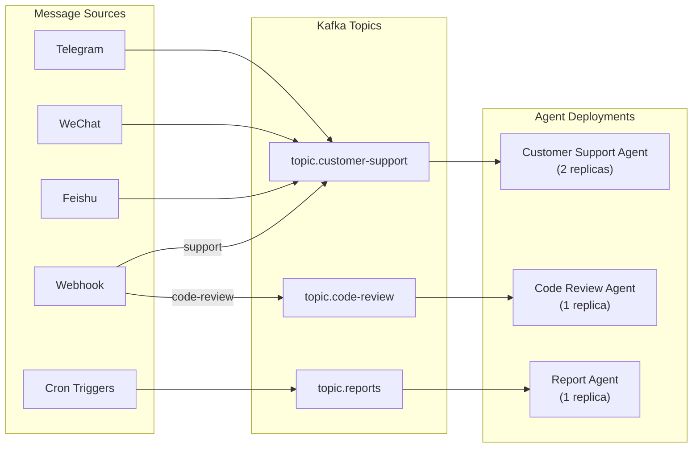
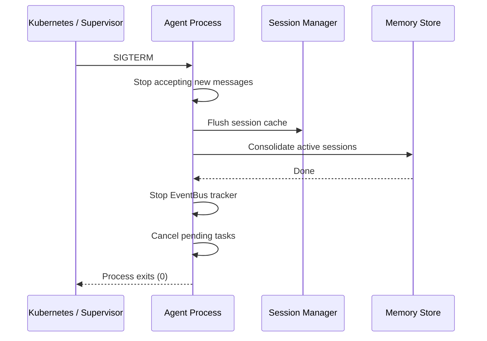
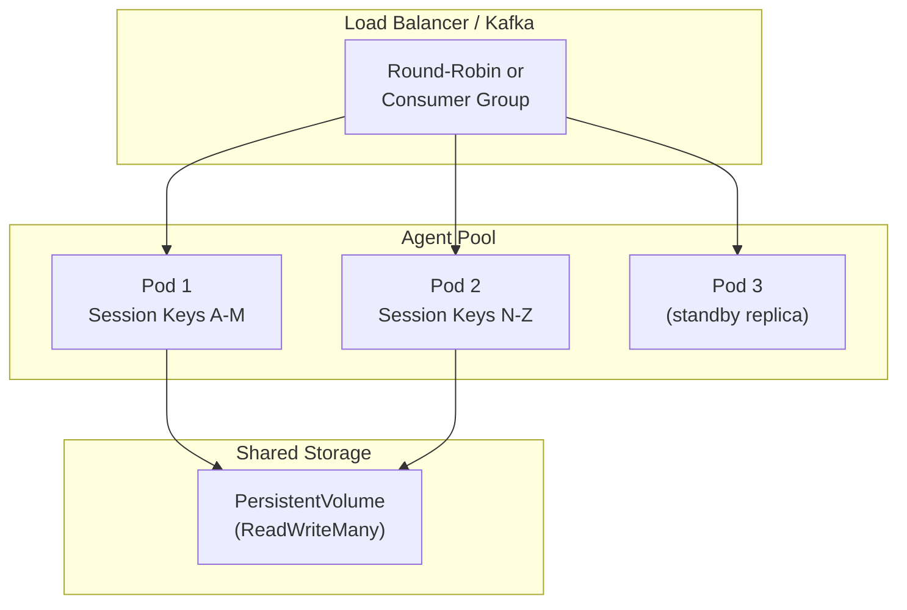

# Deployment

This guide covers production deployment of llm-harness agents. The harness is designed to be deployment-agnostic — the same agent code runs in a CLI, a Docker container, a Kubernetes pod, or as a serverless function.

---

## Docker

### Sample Dockerfile

```dockerfile
FROM python:3.11-slim AS builder

WORKDIR /app

# Install build dependencies
RUN apt-get update && apt-get install -y --no-install-recommends \
    gcc \
    && rm -rf /var/lib/apt/lists/*

# Install uv for fast dependency resolution
COPY --from=ghcr.io/astral-sh/uv:latest /uv /bin/uv

# Copy dependency specification
COPY pyproject.toml ./

# Install production dependencies
RUN uv sync --no-dev

# Final stage
FROM python:3.11-slim

WORKDIR /app

# Install runtime dependencies
RUN apt-get update && apt-get install -y --no-install-recommends \
    ca-certificates \
    curl \
    && rm -rf /var/lib/apt/lists/*

# Copy installed packages from builder
COPY --from=builder /app/.venv /app/.venv
COPY --from=builder /usr/local/lib/python3.11/site-packages /usr/local/lib/python3.11/site-packages

# Copy application code
COPY src/ ./src/
COPY config.yaml ./

# Set Python path
ENV PATH="/app/.venv/bin:$PATH"
ENV PYTHONPATH="/app/src:$PYTHONPATH"
ENV PYTHONUNBUFFERED=1

# Health check
HEALTHCHECK --interval=30s --timeout=10s --start-period=5s --retries=3 \
    CMD curl -f http://localhost:8080/health || exit 1

# Expose health/metrics port
EXPOSE 8080

# Run as non-root user
RUN useradd -m -u 1001 harness
USER harness

ENTRYPOINT ["python", "-m", "app.main"]
```

### Multi-Stage Build

The multi-stage build pattern above:

1. **Builder stage**: Compiles dependencies using `uv` (significantly faster than pip)
2. **Final stage**: Minimal runtime image with only the artifacts needed — no build tools, no compilers

The resulting image is typically under 200MB for a standard deployment.

### Docker Compose

```yaml
version: "3.9"

services:
  agent:
    build: .
    container_name: my-agent
    restart: unless-stopped
    environment:
      - HARNESS_AGENT__MODEL=gpt-4o
      - HARNESS_AGENT__API_KEY=${API_KEY}
      - HARNESS_AGENT__API_BASE=https://api.openai.com/v1
      - HARNESS_AGENT__WORKSPACE=/data/workspace
      - HARNESS_OBSERVABILITY__TRACK_FILE=/data/track.jsonl
    volumes:
      - agent-data:/data
    ports:
      - "8080:8080"

volumes:
  agent-data:
```

---

## Kubernetes

### Deployment Manifest

The recommended pattern is one `Deployment` per agent scenario. Each deployment has its own tool configuration, model, and workspace.

```yaml
apiVersion: apps/v1
kind: Deployment
metadata:
  name: customer-support-agent
  namespace: ai-agents
  labels:
    app: llm-harness
    agent: customer-support
spec:
  replicas: 2
  strategy:
    type: RollingUpdate
    rollingUpdate:
      maxUnavailable: 0
      maxSurge: 1
  selector:
    matchLabels:
      app: llm-harness
      agent: customer-support
  template:
    metadata:
      labels:
        app: llm-harness
        agent: customer-support
    spec:
      serviceAccountName: agent-sa
      securityContext:
        runAsNonRoot: true
        runAsUser: 1001
        fsGroup: 1001
      containers:
        - name: agent
          image: registry.example.com/llm-harness/customer-support:v1.2.3
          imagePullPolicy: Always
          ports:
            - containerPort: 8080
              name: health
            - containerPort: 9090
              name: metrics
          env:
            # Agent configuration
            - name: HARNESS_AGENT__MODEL
              value: "claude-sonnet-4-6"
            - name: HARNESS_AGENT__MAX_TOKENS
              value: "8192"
            - name: HARNESS_AGENT__WORKSPACE
              value: "/data/workspace"

            # Provider credentials (from Secret)
            - name: HARNESS_AGENT__API_KEY
              valueFrom:
                secretKeyRef:
                  name: provider-credentials
                  key: anthropic-api-key
            - name: HARNESS_AGENT__API_BASE
              valueFrom:
                secretKeyRef:
                  name: provider-credentials
                  key: anthropic-api-base

            # Tool configuration
            - name: HARNESS_TOOLS__ENABLED
              value: "[\"read_file\",\"write_file\",\"web_search\",\"exec\",\"message\"]"
            - name: HARNESS_TOOLS__RESTRICT_TO_WORKSPACE
              value: "true"
            - name: HARNESS_TOOLS__EXEC_TIMEOUT
              value: "120"

            # Permission mode
            - name: HARNESS_PERMISSION__MODE
              value: "full_auto"

            # Observability
            - name: HARNESS_OBSERVABILITY__TRACK_FILE
              value: "/data/track.jsonl"

            # Runtime
            - name: HARNESS_AGENT__TIMEZONE
              value: "Asia/Shanghai"
            - name: PYTHONUNBUFFERED
              value: "1"
          envFrom:
            - configMapRef:
                name: agent-common-config

          volumeMounts:
            - name: workspace
              mountPath: /data
            - name: config
              mountPath: /app/config.yaml
              subPath: config.yaml

          resources:
            requests:
              cpu: "1"
              memory: "2Gi"
            limits:
              cpu: "2"
              memory: "4Gi"

          livenessProbe:
            httpGet:
              path: /health
              port: 8080
            initialDelaySeconds: 30
            periodSeconds: 15
            timeoutSeconds: 5

          readinessProbe:
            httpGet:
              path: /health/ready
              port: 8080
            initialDelaySeconds: 5
            periodSeconds: 10
            timeoutSeconds: 3

          startupProbe:
            httpGet:
              path: /health/startup
              port: 8080
            initialDelaySeconds: 1
            periodSeconds: 3
            failureThreshold: 30

      volumes:
        - name: workspace
          persistentVolumeClaim:
            claimName: agent-workspace-pvc
        - name: config
          configMap:
            name: agent-config
```

### Multiple Agent Deployments

Each agent scenario gets its own deployment with a different tool config:

```yaml
# Customer Support Agent — full tool access
apiVersion: apps/v1
kind: Deployment
metadata:
  name: customer-support-agent
spec:
  template:
    spec:
      containers:
        - name: agent
          env:
            - name: HARNESS_TOOLS__ENABLED
              value: '["read_file","write_file","web_search","exec","message","order_lookup","ticket_create"]'
---
# Code Review Agent — read-only tools only
apiVersion: apps/v1
kind: Deployment
metadata:
  name: code-review-agent
spec:
  template:
    spec:
      containers:
        - name: agent
          env:
            - name: HARNESS_TOOLS__ENABLED
              value: '["read_file","glob","grep","web_search","git_diff"]'
            - name: HARNESS_PERMISSION__MODE
              value: "plan"
---
# Scheduled Report Generator — cron-only, no user-facing tools
apiVersion: apps/v1
kind: Deployment
metadata:
  name: report-agent
spec:
  template:
    spec:
      containers:
        - name: agent
          env:
            - name: HARNESS_TOOLS__ENABLED
              value: '["read_file","write_file","web_search","exec"]'
            - name: HARNESS_AGENT__WORKSPACE
              value: "/data/reports"
```

### Service and Ingress

```yaml
apiVersion: v1
kind: Service
metadata:
  name: customer-support-agent
spec:
  selector:
    app: llm-harness
    agent: customer-support
  ports:
    - name: health
      port: 8080
      targetPort: 8080
    - name: metrics
      port: 9090
      targetPort: 9090
  type: ClusterIP
---
apiVersion: networking.k8s.io/v1
kind: Ingress
metadata:
  name: agent-ingress
  annotations:
    nginx.ingress.kubernetes.io/ssl-redirect: "true"
spec:
  tls:
    - hosts:
        - api.agents.example.com
      secretName: agent-tls
  rules:
    - host: api.agents.example.com
      http:
        paths:
          - path: /customer-support
            pathType: Prefix
            backend:
              service:
                name: customer-support-agent
                port:
                  number: 8080
          - path: /code-review
            pathType: Prefix
            backend:
              service:
                name: code-review-agent
                port:
                  number: 8080
```

---

## Multi-Agent with Kafka

For deployments where multiple agent instances need to process messages from different sources, the recommended pattern is **one Kafka topic per agent scenario**:



### Kafka Integration Pattern

```python
import asyncio
import json
from aiokafka import AIOKafkaConsumer, AIOKafkaProducer
from agent_harness import Agent, Harness, InboundMessage, OutboundMessage


class KafkaAgentBridge:
    """Bridge between Kafka topics and an llm-harness Agent."""

    def __init__(
        self,
        agent: Agent,
        bootstrap_servers: str,
        input_topic: str,
        output_topic: str,
        group_id: str,
    ):
        self.agent = agent
        self.bootstrap_servers = bootstrap_servers
        self.input_topic = input_topic
        self.output_topic = output_topic
        self.group_id = group_id

    async def run(self):
        consumer = AIOKafkaConsumer(
            self.input_topic,
            bootstrap_servers=self.bootstrap_servers,
            group_id=self.group_id,
            value_deserializer=lambda m: json.loads(m.decode()),
        )
        producer = AIOKafkaProducer(
            bootstrap_servers=self.bootstrap_servers,
            value_serializer=lambda v: json.dumps(v).encode(),
        )

        await consumer.start()
        await producer.start()

        try:
            async for msg in consumer:
                payload = msg.value
                inbound = InboundMessage(
                    channel=payload.get("channel", "kafka"),
                    sender_id=payload.get("sender_id", "system"),
                    chat_id=payload.get("chat_id", msg.key.decode() if msg.key else "default"),
                    content=payload.get("content", ""),
                )
                result = await self.agent.process(inbound)

                if result:
                    await producer.send(
                        self.output_topic,
                        key=msg.key,
                        value={
                            "channel": result.channel,
                            "chat_id": result.chat_id,
                            "content": result.content,
                            "metadata": result.metadata,
                        },
                    )
        finally:
            await consumer.stop()
            await producer.stop()
```

This pattern gives you:

- **Consumer group load balancing** within each agent deployment
- **Topic isolation** between agent scenarios
- **Exactly-once semantics** (Kafka transactions)
- **Backpressure** via consumer lag
- **Replay capability** by resetting consumer offsets

---

## Environment Variables Reference

llm-harness reads configuration from environment variables using the `model_config = ConfigDict(env_prefix=...)` mechanism on each config model.

| Environment Variable | Corresponding Config | Default | Description |
|---------------------|---------------------|---------|-------------|
| `HARNESS_AGENT__MODEL` | `agent.model` | `claude-sonnet-4-6` | LLM model identifier |
| `HARNESS_AGENT__PROVIDER` | `agent.provider` | `auto` | Provider name (or `auto` for detection) |
| `HARNESS_AGENT__API_KEY` | `agent.api_key` | `""` | API key for the LLM provider |
| `HARNESS_AGENT__API_BASE` | `agent.api_base` | `None` | Custom API base URL |
| `HARNESS_AGENT__WORKSPACE` | `agent.workspace` | `~/.agent-harness/workspace` | Working directory for sessions, memory, logs |
| `HARNESS_AGENT__MAX_TOKENS` | `agent.max_tokens` | `8192` | Max completion tokens per LLM call |
| `HARNESS_AGENT__MAX_ITERATIONS` | `agent.max_iterations` (via Agent) | `40` | Max ReAct loop iterations |
| `HARNESS_AGENT__TEMPERATURE` | `agent.temperature` | `0.7` | LLM temperature |
| `HARNESS_AGENT__REASONING_EFFORT` | `agent.reasoning_effort` | `None` | Reasoning effort (for reasoning models) |
| `HARNESS_AGENT__TIMEZONE` | `agent.timezone` | `UTC` | Timezone for cron and timestamps |
| `HARNESS_TOOLS__ENABLED` | `tools.enabled` | `["*"]` | JSON list of enabled tools |
| `HARNESS_TOOLS__DISABLED` | `tools.disabled` | `[]` | JSON list of disabled tools |
| `HARNESS_TOOLS__EXEC_TIMEOUT` | `tools.exec_timeout` | `60` | Command execution timeout (seconds) |
| `HARNESS_TOOLS__EXEC_ENABLE` | `tools.exec_enable` | `true` | Enable shell execution tool |
| `HARNESS_TOOLS__WEB_SEARCH_PROVIDER` | `tools.web_search_provider` | `duckduckgo` | Web search backend |
| `HARNESS_TOOLS__WEB_SEARCH_MAX_RESULTS` | `tools.web_search_max_results` | `5` | Max web search results |
| `HARNESS_TOOLS__RESTRICT_TO_WORKSPACE` | `tools.restrict_to_workspace` | `false` | Constrain file tools to workspace |
| `HARNESS_PERMISSION__MODE` | `permission.mode` | `default` | Permission mode (`default`, `plan`, `full_auto`) |
| `HARNESS_PERMISSION__ALLOWED_TOOLS` | `permission.allowed_tools` | `[]` | Tools always allowed (JSON list) |
| `HARNESS_PERMISSION__DENIED_TOOLS` | `permission.denied_tools` | `[]` | Tools always denied (JSON list) |
| `HARNESS_OBSERVABILITY__TRACK_FILE` | `observability.track_file` | `None` | Path for JSONL tracking file |
| `HARNESS_SANDBOX__ENABLED` | `sandbox.enabled` | `false` | Enable OS sandbox for commands |

### Provider-Specific Environment Variables

Provider SDKs are detected and configured automatically. Here are the standard env vars they expect:

| Variable | Providers | Description |
|----------|-----------|-------------|
| `ANTHROPIC_API_KEY` | Anthropic | Claude API key |
| `OPENAI_API_KEY` | OpenAI, AiHubMix, SiliconFlow, VolcEngine | OpenAI-compatible API key |
| `DEEPSEEK_API_KEY` | DeepSeek | DeepSeek API key |
| `DASHSCOPE_API_KEY` | DashScope (Qwen) | Alibaba Cloud API key |
| `GEMINI_API_KEY` | Gemini | Google API key |
| `MOONSHOT_API_KEY` | Moonshot (Kimi) | Moonshot API key |
| `ZAI_API_KEY` | Zhipu (GLM) | Zhipu API key |
| `OPENROUTER_API_KEY` | OpenRouter | OpenRouter API key |
| `MISTRAL_API_KEY` | Mistral | Mistral API key |
| `GROQ_API_KEY` | Groq | Groq API key |
| `MINIMAX_API_KEY` | MiniMax | MiniMax API key |

---

## Resource Recommendations

| Deployment Scale | Model Tier | CPU | Memory | Storage | Network |
|----------------|------------|-----|--------|---------|---------|
| **Development / single-user** | Small (GPT-4o-mini, Claude Haiku) | 0.5-1 core | 512MB-1GB | 1GB | N/A |
| **Production / light** | Medium (GPT-4o, Claude Sonnet) | 1-2 cores | 2-4GB | 10GB | 50Mbps |
| **Production / heavy** | Large (Claude Opus, DeepSeek V4) | 2-4 cores | 4-8GB | 50GB | 100Mbps |
| **Enterprise / multi-channel** | Mixed (auto-select by task) | 4-8 cores | 8-16GB | 100GB+ | 200Mbps+ |

### Memory Breakdown

The harness itself is lightweight. Memory consumption depends primarily on conversation history and concurrent sessions:

```
Base harness memory: ~30-50MB
Per session overhead:  ~1-5MB (history + cache)
Per tool call:       ~10-50MB (tool results, especially web_fetch)
Concurrency overhead: ~50-100MB per additional concurrent session
```

### Storage Breakdown

| Data | Growth Rate | Retention | Recommendation |
|------|------------|-----------|---------------|
| Session history (JSONL) | ~1-10KB per turn | Configurable | Rotate weekly; archive to S3 |
| Memory (MEMORY.md) | ~1KB per consolidation | Permanent | Back up regularly |
| Tracking logs (JSONL) | ~1-5KB per turn | Configurable | Ship to log aggregation |
| Workspace files | Variable | Per task | Use PVC with reclaim policy |

---

## Health Check Endpoints

The harness exposes three health check endpoints for Kubernetes probes:

```python
from fastapi import FastAPI
from agent_harness import Agent

app = FastAPI()

@app.get("/health/startup")
async def startup():
    """Returns 200 once the agent is fully initialized."""
    return {"status": "ok"}

@app.get("/health/ready")
async def readiness():
    """Returns 200 when the agent can accept requests."""
    # Check provider connectivity
    try:
        await agent.harness.provider.chat_with_retry(
            messages=[{"role": "user", "content": "ping"}],
            max_tokens=10,
        )
        return {"status": "ok", "provider": "connected"}
    except Exception as e:
        return {"status": "degraded", "reason": str(e)}

@app.get("/health")
async def liveness():
    """Returns 200 if the process is alive and basic subsystems respond."""
    return {
        "status": "ok",
        "version": agent.__version__,
        "uptime_seconds": ...,
        "active_sessions": len(agent._session_locks),
    }

@app.get("/metrics")
async def metrics():
    """Prometheus metrics endpoint."""
    total_tokens = sum(
        s.usage.get("total_tokens", 0)
        for s in sessions  # hypothetical
    )
    return {
        "total_tokens_used": total_tokens,
        "active_sessions": len(agent._session_locks),
        "tools_available": len(agent.harness.tools.list_tools()),
    }
```

### Probe Configuration Summary

| Probe | Purpose | Port | Path | Initial Delay |
|-------|---------|------|------|---------------|
| Startup | Wait for model load, provider init | 8080 | `/health/startup` | 1s |
| Readiness | Provider connectivity, dependency check | 8080 | `/health/ready` | 5s |
| Liveness | Process alive, no deadlock | 8080 | `/health` | 30s |

---

## Graceful Shutdown

```python
import asyncio
import signal
from agent_harness import Agent, MemoryConsolidator


async def shutdown(agent: Agent, sig: signal.Signals):
    """Gracefully shut down the agent."""
    print(f"Received {sig.name}, shutting down...")

    # 1. Stop accepting new messages
    agent.harness.sessions.save_all()  # Flush session cache

    # 2. Force memory consolidation for active sessions
    if agent._consolidator:
        for session_key, lock in agent._session_locks.items():
            session = agent.harness.sessions.get_or_create(session_key)
            await agent._consolidator.maybe_consolidate_by_tokens(session)

    # 3. Stop tracker
    if agent.harness.tracker:
        await agent.harness.tracker.stop()

    # 4. Cancel pending tasks
    tasks = [t for t in asyncio.all_tasks() if t is not asyncio.current_task()]
    for task in tasks:
        task.cancel()
    await asyncio.gather(*tasks, return_exceptions=True)

    print("Shutdown complete.")


async def main():
    agent = Agent(...)

    loop = asyncio.get_event_loop()
    for sig in (signal.SIGTERM, signal.SIGINT):
        loop.add_signal_handler(sig, lambda s=sig: asyncio.create_task(shutdown(agent, s)))

    # Start agent
    ...
```

### Shutdown Sequence



---

## Scaling Strategies

### Horizontal Scaling (Multiple Pods)



**Key considerations:**

- **Session affinity**: Route messages from the same session to the same pod to maximize cache efficiency. Use `sticky sessions` or Kafka message keys.
- **Shared storage**: Session files and memory must be on shared storage (`ReadWriteMany` PVC). The append-only JSONL format is safe for concurrent reads.
- **Provider rate limits**: Each pod consumes from the same API key. Account for aggregate rate limits when setting `max_concurrent` and pod count.
- **Graceful degradation**: If provider rate limits are hit, the built-in retry with backoff handles it transparently. Consider a circuit breaker for sustained overload.

### Vertical Scaling (Single Pod, More Resources)

For single-agent deployments (e.g., a personal assistant), vertical scaling is often sufficient:

- Increase `max_concurrent` to handle more simultaneous sessions
- Increase `max_iterations` for complex multi-step tasks
- Increase `max_tokens` for long-form generation
- Allocate more memory for larger conversation histories

### Different Tool Configs per Pod

In a multi-agent deployment, each pod can have a different tool configuration:

```yaml
# Pod 1: Customer support (all tools including order lookup)
env:
  - name: HARNESS_TOOLS__ENABLED
    value: '["read_file","write_file","web_search","exec","message","order_lookup"]'

# Pod 2: Code review (read-only tools only)
env:
  - name: HARNESS_TOOLS__ENABLED
    value: '["read_file","glob","grep","web_search"]'
  - name: HARNESS_PERMISSION__MODE
    value: "plan"

# Pod 3: Report generation (tools only, no interactive channels)
env:
  - name: HARNESS_TOOLS__ENABLED
    value: '["read_file","write_file","web_search","exec"]'
  - name: HARNESS_AGENT__MODEL
    value: "gpt-4o-mini"
```

This is achieved without code changes — the same Docker image is deployed with different environment variables.

---

## Security Considerations

### Network Isolation

```yaml
# Kubernetes NetworkPolicy
apiVersion: networking.k8s.io/v1
kind: NetworkPolicy
metadata:
  name: agent-network-policy
spec:
  podSelector:
    matchLabels:
      app: llm-harness
  policyTypes:
    - Egress
  egress:
    # Allow LLM provider API
    - to:
        - ipBlock:
            cidr: PROVIDER_API_CIDR/32
      ports:
        - port: 443
    # Allow DNS
    - to:
        - namespaceSelector: {}
      ports:
        - port: 53
          protocol: UDP
    # Allow web_search tool
    - to:
        - ipBlock:
            cidr: 0.0.0.0/0
      ports:
        - port: 443
```

### Credential Management

```yaml
apiVersion: v1
kind: Secret
metadata:
  name: provider-credentials
type: Opaque
stringData:
  anthropic-api-key: "sk-ant-..."
---
apiVersion: secrets-store.csi.x-k8s.io/v1
kind: SecretProviderClass
metadata:
  name: agent-aws-secrets
spec:
  provider: aws
  parameters:
    objects: |
      - objectName: "prod/llm-harness/anthropic-key"
        objectType: "secretsmanager"
```

### Pod Security Context

```yaml
securityContext:
  runAsNonRoot: true
  runAsUser: 1001
  fsGroup: 1001
  capabilities:
    drop:
      - ALL
  readOnlyRootFilesystem: true
  seccompProfile:
    type: RuntimeDefault
```

### Workspace Volume

```yaml
apiVersion: v1
kind: PersistentVolumeClaim
metadata:
  name: agent-workspace-pvc
spec:
  accessModes:
    - ReadWriteMany
  resources:
    requests:
      storage: 10Gi
  storageClassName: nfs-client
```

---

## Monitoring & Observability

### Prometheus Integration

Configure the EventBus to emit Prometheus metrics:

```python
from agent_harness.observability.bus import get_event_bus
from agent_harness.observability.events import (
    ToolExecutionCompleted, AssistantTurnComplete, ErrorEvent
)
from prometheus_client import Counter, Histogram, Gauge

tool_duration = Histogram(
    "agent_tool_duration_seconds",
    "Tool execution duration",
    ["tool_name"]
)
tool_errors = Counter(
    "agent_tool_errors_total",
    "Tool execution errors",
    ["tool_name"]
)
token_usage = Counter(
    "agent_token_usage_total",
    "Token usage",
    ["type"]  # "prompt" or "completion"
)
active_sessions = Gauge(
    "agent_active_sessions",
    "Currently active sessions"
)

async def metrics_listener(event):
    if isinstance(event, ToolExecutionCompleted):
        label = [event.tool_name]
        if event.duration_ms:
            tool_duration.labels(*label).observe(event.duration_ms / 1000)
        if event.is_error:
            tool_errors.labels(*label).inc()
    elif isinstance(event, AssistantTurnComplete):
        if event.usage:
            token_usage.labels("prompt").inc(event.usage.get("prompt_tokens", 0))
            token_usage.labels("completion").inc(event.usage.get("completion_tokens", 0))

bus = get_event_bus()
bus.subscribe(metrics_listener)
```

### Log Aggregation

The tracker writes structured JSONL that integrates directly with log aggregation tools:

```json
{"type": "AssistantTurnComplete", "ts": "...", "data": {"usage": {"prompt_tokens": 1200, "completion_tokens": 350}}}
```

Ship this to your log aggregator (ELK, Datadog, Grafana Loki) for dashboards and alerting.

### Key Metrics to Monitor

| Metric | What It Tells You | Alert Threshold |
|--------|-------------------|-----------------|
| Tool duration P99 | Slow tools impacting user experience | >30s |
| Error rate | Provider issues, misconfigured tools | >5% |
| Token usage per turn | Cost tracking, context window management | >80% of limit |
| Active sessions | Resource utilization | >80% of max_concurrent |
| Queue depth | Backpressure indicator | >100 |
| Memory consolidation frequency | Context window efficiency | <1 per 10 turns |

---

## Troubleshooting

### Common Deployment Issues

| Problem | Likely Cause | Solution |
|---------|-------------|----------|
| Agent won't start | Missing API key or provider SDK | Check `HARNESS_AGENT__API_KEY` and `pip install llm-harness[anthropic]` or `[openai]` |
| Tool calls fail with permission errors | Permission mode too strict | Set `HARNESS_PERMISSION__MODE=full_auto` for trusted environments |
| Out of memory | Too many concurrent sessions | Reduce `max_concurrent` or increase pod memory |
| Slow responses | Provider rate limiting | Reduce concurrency, add `max_concurrent` ceiling, or use a different provider tier |
| Session data lost | PVC not `ReadWriteMany` | Ensure shared storage supports concurrent access |
| Cron jobs don't fire | Timezone mismatch | Set `HARNESS_AGENT__TIMEZONE` to match the expected schedule's timezone |
