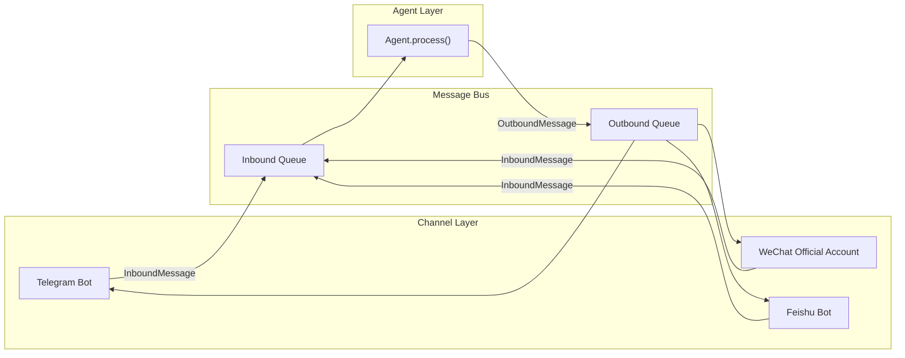
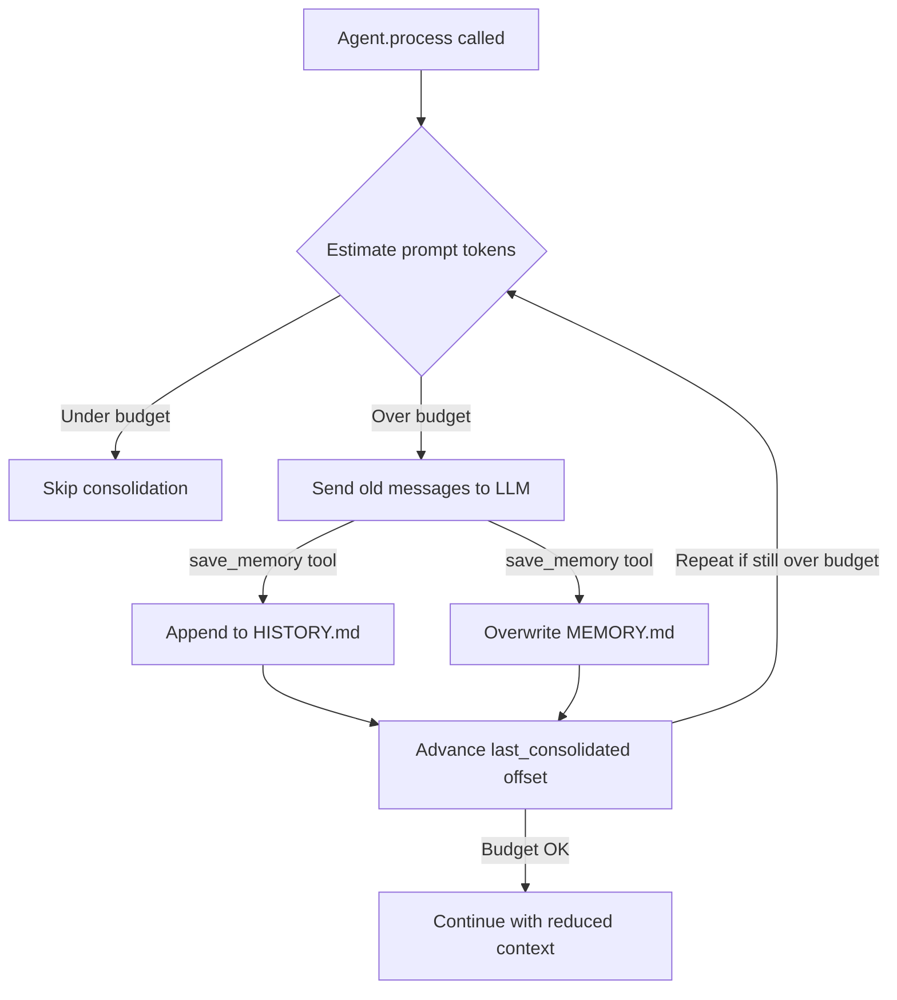

# Examples

This page shows real-world usage patterns for llm-harness. Each example highlights a different aspect of the framework — from custom tools to multi-channel deployment to persistent memory.

The examples are deliberately concise. They show the interesting parts, not every line of a complete application.

---

## Example 1: Customer Service Agent

A customer support agent that can look up orders, create tickets in Zendesk, and access a knowledge base. Demonstrates custom tools, Zendesk integration, and structured error handling.

### What It Does

- Answers customer questions about orders, shipping, and returns
- Looks up order details from an internal API
- Creates Zendesk tickets for complex issues
- Searches a knowledge base for known solutions

### Key Code

```python
import httpx
from pydantic import BaseModel, Field
from agent_harness import (
    Agent, Harness, BaseTool, ToolResult, ToolExecutionContext,
    OpenAICompatProvider, InboundMessage,
)
from agent_harness.prompts.sections import IdentitySection


# ---- Custom tool: Order Query ----

class OrderQueryInput(BaseModel):
    order_id: str = Field(description="The customer's order ID, e.g. ORD-12345")

class OrderQueryTool(BaseTool):
    name = "order_query"
    description = "Look up an order by its order ID. Returns status, items, shipping info."
    input_model = OrderQueryInput

    def __init__(self, api_base: str, api_key: str):
        self._client = httpx.AsyncClient(
            base_url=api_base,
            headers={"Authorization": f"Bearer {api_key}"},
        )

    async def execute(self, arguments: OrderQueryInput, context: ToolExecutionContext) -> ToolResult:
        try:
            resp = await self._client.get(f"/orders/{arguments.order_id}")
            resp.raise_for_status()
            data = resp.json()
            return ToolResult(
                output=(
                    f"Order {data['id']}:\n"
                    f"  Status: {data['status']}\n"
                    f"  Items: {', '.join(data['items'])}\n"
                    f"  Shipping: {data['shipping']['carrier']} - {data['shipping']['status']}\n"
                    f"  Estimated delivery: {data['shipping']['estimated_delivery']}"
                )
            )
        except httpx.HTTPStatusError as e:
            if e.response.status_code == 404:
                return ToolResult(output="Error: Order not found. Please verify the order ID.")
            return ToolResult(output=f"Error: Order service unavailable ({e.response.status_code}). Please try again later.")
        except httpx.RequestError as e:
            return ToolResult(output=f"Error: Cannot reach order service ({e}). Please try again.")

    def is_read_only(self, arguments: OrderQueryInput) -> bool:
        return True


# ---- Custom tool: Zendesk Ticket Creation ----

class TicketCreateInput(BaseModel):
    subject: str = Field(description="Ticket subject line")
    description: str = Field(description="Detailed description of the issue")
    priority: str = Field(default="normal", description="Priority: low, normal, high, urgent")
    customer_email: str = Field(description="Customer's email address")

class TicketCreateTool(BaseTool):
    name = "ticket_create"
    description = "Create a support ticket in Zendesk. Use when you cannot resolve the issue directly."
    input_model = TicketCreateInput

    def __init__(self, zendesk_subdomain: str, zendesk_email: str, zendesk_token: str):
        self._client = httpx.AsyncClient(
            base_url=f"https://{zendesk_subdomain}.zendesk.com/api/v2",
            auth=(f"{zendesk_email}/token", zendesk_token),
        )

    async def execute(self, arguments: TicketCreateInput, context: ToolExecutionContext) -> ToolResult:
        payload = {
            "ticket": {
                "subject": arguments.subject,
                "comment": {"body": arguments.description},
                "priority": arguments.priority,
                "requester": {"email": arguments.customer_email},
            }
        }
        try:
            resp = await self._client.post("/tickets.json", json=payload)
            resp.raise_for_status()
            ticket = resp.json()["ticket"]
            return ToolResult(
                output=f"Ticket #{ticket['id']} created successfully. Status: {ticket['status']}",
                metadata={"ticket_id": ticket["id"]},
            )
        except httpx.HTTPStatusError as e:
            return ToolResult(
                output=f"Error: Failed to create ticket ({e.response.status_code}). Please try again.",
                is_error=True,
            )

    def is_read_only(self, arguments: TicketCreateInput) -> bool:
        return False


# ---- Agent Setup ----

agent = Agent(
    Harness(
        provider=OpenAICompatProvider(
            api_key="sk-...",
            api_base="https://api.openai.com/v1",
        ),
        tools=[
            OrderQueryTool(api_base="https://orders.internal.example.com", api_key="..."),
            TicketCreateTool(
                zendesk_subdomain="mycompany",
                zendesk_email="support@mycompany.com",
                zendesk_token="...",
            ),
            # Built-in tools
            "web_search",
            "read_file",
        ],
        context=[IdentitySection(
            "You are a customer support agent for MyCompany. "
            "Answer questions about orders, shipping, and returns. "
            "If you cannot resolve an issue, create a Zendesk ticket with a clear description."
        )],
        permissions="default",  # Mutating tools require confirmation
        sessions="./data/sessions",
        memory="./data/memory",
    ),
    model="gpt-4o",
)

# Process a customer inquiry
result = await agent.process(InboundMessage(
    channel="chat",
    sender_id="customer@example.com",
    chat_id="c1",
    content="Where is my order ORD-12345? It was supposed to arrive yesterday.",
))
```

### What Parts of the Harness Are Used

| Component | Usage |
|-----------|-------|
| `BaseTool` | Custom `OrderQueryTool` and `TicketCreateTool` |
| `ToolResult` | Structured output with error handling |
| `Harness` | Wires provider, custom tools, built-in tools, permissions, sessions, memory |
| `Agent.process()` | Single entry point for all messages |
| `IdentitySection` | System prompt context |
| `SessionManager` | Per-customer conversation history |
| `PermissionChecker` | Confirmation before creating tickets |
| `MemoryStore` | Remembers customer preferences across sessions |

---

## Example 2: CLI Personal Assistant

An interactive command-line agent with streaming output, file operations, and web search. Demonstrates the `AgentLoop` at a lower level.

### What It Does

- Interactive REPL with streaming responses
- File read/write, code execution, web search
- Human-in-the-loop confirmation for destructive operations
- Session persistence across invocations

### Key Code

```python
import asyncio
import sys
from agent_harness import Agent, Harness, AnthropicProvider, InboundMessage
from agent_harness.prompts.sections import IdentitySection
from agent_harness.loop.agent import LoopCallbacks, AgentLoop


# ---- Interactive shell with streaming ----

class InteractiveShell:
    """REPL that streams agent responses token-by-token to stdout."""

    def __init__(self, model: str = "claude-sonnet-4-6"):
        self.agent = Agent(
            Harness(
                provider=AnthropicProvider(api_key="sk-ant-..."),
                tools=["read_file", "write_file", "edit_file", "exec",
                       "web_search", "web_fetch", "glob", "grep",
                       "notebook_edit", "message"],
                context=[IdentitySection(
                    "You are a CLI programming assistant. You can read/write files, "
                    "run commands, search the web, and edit Jupyter notebooks. "
                    "Always explain what you are doing before executing."
                )],
                permissions="default",
                sessions="~/.assistant/sessions",
                memory="~/.assistant/memory",
                tracker="~/.assistant/track.jsonl",
            ),
            model=model,
            max_iterations=30,
        )

    async def run(self):
        """Interactive REPL loop."""
        print("Assistant ready. Ctrl+D to exit.\n")

        while True:
            try:
                prompt = input(">>> ").strip()
                if not prompt:
                    continue
            except (EOFError, KeyboardInterrupt):
                print("\nGoodbye!")
                break

            # Stream the response token-by-token
            sys.stdout.write("... ")
            sys.stdout.flush()

            original_loop = self.agent._loop

            # Inject streaming into the loop
            async def stream_delta(text: str):
                sys.stdout.write(text)
                sys.stdout.flush()

            streaming_loop = AgentLoop(
                provider=original_loop.provider,
                callbacks=LoopCallbacks(
                    build_messages=original_loop.callbacks.build_messages,
                    execute_tool=original_loop.callbacks.execute_tool,
                    get_tool_definitions=original_loop.callbacks.get_tool_definitions,
                    on_stream=stream_delta,
                ),
                model=original_loop.model,
                max_iterations=original_loop.max_iterations,
            )

            # Temporarily swap the loop
            self.agent._loop = streaming_loop

            result = await self.agent.process(InboundMessage(
                channel="cli",
                sender_id="user",
                chat_id="default",
                content=prompt,
            ))

            self.agent._loop = original_loop  # restore

            if result:
                print()  # trailing newline after stream

            # Show tool usage summary
            last_result = streaming_loop._last_turn_result
            if last_result and last_result.tools_used:
                print(f"\n  [tools: {', '.join(last_result.tools_used)}]")

    async def aclose(self):
        """Clean shutdown."""
        if self.agent.harness.tracker:
            await self.agent.harness.tracker.stop()


# ---- Entry point ----

async def main():
    shell = InteractiveShell()
    try:
        await shell.run()
    finally:
        await shell.aclose()

asyncio.run(main())
```

### What Parts of the Harness Are Used

| Component | Usage |
|-----------|-------|
| `Agent.process()` | Core entry point for each user message |
| `AgentLoop` | Directly constructed with streaming callbacks |
| `LoopCallbacks.on_stream` | Token-by-token streaming to stdout |
| `Harness` | Wires 10 built-in tools with permissions |
| `SessionManager` | Persists conversation history across invocations |
| `MemoryStore` | Long-term memory across sessions |
| `Tracker` | JSONL audit trail for debugging |
| `PermissionChecker` | Confirmation for mutating operations |

---

## Example 3: Scheduled Reporter

A cron-based agent that generates daily reports and delivers them via email or Slack. Demonstrates the `CronService`, system channels, and automated operation.

### What It Does

- Runs every morning at 8:00 AM
- Gathers data from internal APIs and web searches
- Compiles a markdown report with key metrics
- Posts the report to Slack and/or email
- Archives reports in the workspace

### Key Code

```python
import asyncio
from datetime import datetime
from agent_harness import (
    Agent, Harness, OpenAICompatProvider,
    CronService, CronSchedule, CronJob,
    InboundMessage, OutboundMessage,
)
from agent_harness.prompts.sections import IdentitySection


# ---- Report Generator Agent ----

class ReportGenerator:
    """Cron-driven daily report generator."""

    def __init__(self):
        self.agent = Agent(
            Harness(
                provider=OpenAICompatProvider(
                    api_key="sk-...",
                    api_base="https://api.openai.com/v1",
                ),
                tools=[
                    "web_search",
                    "web_fetch",
                    "read_file",
                    "write_file",
                    "exec",
                ],
                context=[IdentitySection(
                    "You are a daily report generator. Your job is to:\n"
                    "1. Gather relevant metrics and news\n"
                    "2. Compile a concise markdown report\n"
                    "3. Save the report to the reports directory\n"
                    "4. Return the report content for delivery"
                )],
                permissions="full_auto",  # No approval needed for automated operation
                workspace="./reports-agent",
                sessions="./reports-agent/sessions",
            ),
            model="gpt-4o-mini",  # Cost-effective model for structured tasks
        )

        # Cron service that triggers the report
        self.cron = CronService(
            store_path="./reports-agent/cron-jobs.json",
            on_job=self._execute_job,
        )

    async def _execute_job(self, job: CronJob) -> str | None:
        """Execute a cron job - generate a report."""
        result = await self.agent.process(InboundMessage(
            channel="system",
            sender_id="cron",
            chat_id=job.id,
            content=job.payload.message,
        ))
        if result:
            # Save report to date-stamped file
            date_str = datetime.now().strftime("%Y-%m-%d")
            await self.agent.process(InboundMessage(
                channel="system",
                sender_id="cron",
                chat_id=job.id,
                content=(
                    f"Save today's report to 'reports/{date_str}-daily-report.md'. "
                    f"The report content is:\n\n{result.content}"
                ),
            ))
        return result.content if result else None

    async def start(self):
        """Start the cron service."""
        # Register the daily report job
        self.cron.add_job(
            name="daily-report",
            schedule=CronSchedule(
                kind="cron",
                expr="0 8 * * 1-5",  # Weekdays at 8:00 AM
                tz="America/New_York",
            ),
            message=(
                "Generate today's daily report. Include:\n"
                "- Top 3 tech news stories\n"
                "- System health metrics\n"
                "- Any anomalies from the past 24 hours\n"
                "Format as markdown with sections."
            ),
        )

        # Also add a weekly summary
        self.cron.add_job(
            name="weekly-summary",
            schedule=CronSchedule(
                kind="cron",
                expr="0 9 * * 1",  # Mondays at 9:00 AM
                tz="America/New_York",
            ),
            message="Generate a weekly summary report covering the past 7 days.",
        )

        await self.cron.start()
        print("Report generator running. Press Ctrl+C to stop.")

        # Keep alive
        try:
            while True:
                await asyncio.sleep(60)
        except asyncio.CancelledError:
            pass
        finally:
            self.cron.stop()

    async def stop(self):
        self.cron.stop()


# ---- Slack Notification Channel ----

class SlackNotifier:
    """Sends report summaries to Slack."""

    def __init__(self, webhook_url: str):
        import httpx
        self._client = httpx.AsyncClient()
        self._webhook_url = webhook_url

    async def send_report(self, report_content: str):
        """Post the first 2000 chars of the report to Slack."""
        summary = report_content[:2000]
        await self._client.post(
            self._webhook_url,
            json={"text": f"*Daily Report*\n\n{summary}"},
        )


# ---- Entry point ----

async def main():
    generator = ReportGenerator()
    await generator.start()

asyncio.run(main())
```

### What Parts of the Harness Are Used

| Component | Usage |
|-----------|-------|
| `CronService` | Manages cron jobs with cron expressions, timezone support |
| `CronJob` / `CronSchedule` | Job definitions with scheduling |
| `Agent.process()` | Triggered by cron to generate reports |
| `Harness` | Wires cost-effective model, tools, full_auto permissions |
| `InboundMessage` | System channel for automation triggers |
| `PermissionMode.FULL_AUTO` | No confirmation needed for automated operation |

---

## Example 4: Multi-Channel Bot

A single agent that serves users across Telegram, WeChat, and Feishu simultaneously. Demonstrates `ChannelManager`, `BaseChannel`, and the message bus pattern.

### What It Does

- Receives messages from Telegram, WeChat, and Feishu
- Processes them through the same agent
- Delivers responses back to the correct channel
- Maintains separate sessions per channel and user
- Supports streaming output where channels allow

### Key Code

```python
import asyncio
from agent_harness import (
    Agent, Harness, AnthropicProvider,
    InboundMessage, MessageBus,
    BaseChannel,
)
from agent_harness.channels.manager import ChannelManager
from agent_harness.prompts.sections import IdentitySection


# ---- Custom Channel: Telegram ----

class TelegramChannel(BaseChannel):
    """Telegram bot channel using python-telegram-bot."""

    name = "telegram"
    display_name = "Telegram"

    def __init__(self, config, bus):
        super().__init__(config, bus)
        self._token = config.get("token", "")
        self._app = None

    async def start(self):
        from telegram.ext import Application, MessageHandler, filters

        self._app = Application.builder().token(self._token).build()

        async def handle_update(update, context):
            if update.message and update.message.text:
                await self._handle_message(
                    sender_id=str(update.message.from_user.id),
                    chat_id=str(update.message.chat_id),
                    content=update.message.text,
                )

        self._app.add_handler(MessageHandler(filters.TEXT & ~filters.COMMAND, handle_update))
        await self._app.initialize()
        await self._app.start()
        await self._app.updater.start_polling()
        self._running = True

    async def stop(self):
        if self._app:
            await self._app.stop()
            await self._app.shutdown()
        self._running = False

    async def send(self, msg):
        await self._app.bot.send_message(
            chat_id=msg.chat_id,
            text=msg.content,
        )

    async def send_delta(self, chat_id, delta, metadata=None):
        """Streaming support for Telegram."""
        if metadata and metadata.get("_stream_delta"):
            # In a real implementation, you'd use edit_message or a progress bar
            pass


# ---- Custom Channel: WeChat ----

class WeChatChannel(BaseChannel):
    """WeChat official account channel using wechatpy."""

    name = "wechat"
    display_name = "WeChat"

    def __init__(self, config, bus):
        super().__init__(config, bus)
        self._app_id = config.get("app_id", "")
        self._app_secret = config.get("app_secret", "")

    async def start(self):
        # WeChat uses webhook-based communication
        # Start a FastAPI server to receive WeChat messages
        self._running = True

    async def stop(self):
        self._running = False

    async def send(self, msg):
        # Send via WeChat customer service API
        pass


# ---- Feishu Channel ----

class FeishuChannel(BaseChannel):
    """Feishu (Lark) bot channel."""

    name = "feishu"
    display_name = "Feishu"

    def __init__(self, config, bus):
        super().__init__(config, bus)
        self._app_id = config.get("app_id", "")
        self._app_secret = config.get("app_secret", "")

    async def start(self):
        # Feishu uses webhook-based communication
        self._running = True

    async def stop(self):
        self._running = False

    async def send(self, msg):
        # Send via Feishu API
        pass


# ---- Bot Setup ----

async def main():
    # Shared message bus
    bus = MessageBus()

    # Shared agent
    agent = Agent(
        Harness(
            provider=AnthropicProvider(api_key="sk-ant-..."),
            tools=["web_search", "read_file", "write_file", "message"],
            context=[IdentitySection(
                "You are a helpful assistant available on Telegram, WeChat, and Feishu. "
                "You maintain context within each conversation."
            )],
            permissions="default",
            sessions="./bot-data/sessions",
            memory="./bot-data/memory",
        ),
        model="claude-sonnet-4-6",
    )

    # Channel manager with all three channels
    channel_manager = ChannelManager(
        channel_types={
            "telegram": TelegramChannel,
            "wechat": WeChatChannel,
            "feishu": FeishuChannel,
        },
        channels_config={
            "telegram": {
                "enabled": True,
                "token": "YOUR_TELEGRAM_BOT_TOKEN",
                "allow_from": ["*"],  # Allow all users
                "streaming": True,
            },
            "wechat": {
                "enabled": True,
                "app_id": "YOUR_WECHAT_APP_ID",
                "app_secret": "YOUR_WECHAT_APP_SECRET",
                "allow_from": ["*"],
            },
            "feishu": {
                "enabled": True,
                "app_id": "YOUR_FEISHU_APP_ID",
                "app_secret": "YOUR_FEISHU_APP_SECRET",
                "allow_from": ["*"],
            },
        },
        bus=bus,
        send_tool_hints=True,   # Let users see what the agent is doing
        send_progress=True,
    )

    # Agent worker: consume inbound messages, produce outbound
    async def agent_worker():
        while True:
            msg = await bus.consume_inbound()
            result = await agent.process(msg)
            if result:
                await bus.publish_outbound(result)

    # Start everything
    worker_task = asyncio.create_task(agent_worker())
    await channel_manager.start_all()

    # Wait forever (or handle shutdown signals)
    try:
        await asyncio.Event().wait()
    except asyncio.CancelledError:
        pass
    finally:
        worker_task.cancel()
        await channel_manager.stop_all()


asyncio.run(main())
```

### What Parts of the Harness Are Used

| Component | Usage |
|-----------|-------|
| `BaseChannel` | Custom `TelegramChannel`, `WeChatChannel`, `FeishuChannel` |
| `ChannelManager` | Lifecycle management for all channels |
| `MessageBus` | Decouples channel receivers from agent processor |
| `InboundMessage` | Normalized input from all three channels |
| `OutboundMessage` | Normalized output back to all three channels |
| `Agent.process()` | Core message processing |
| `SessionManager` | Per-channel, per-user session isolation (session key: `telegram:12345`) |
| `PermissionChecker` | Confirmation before mutating operations |

### Architecture



---

## Example 5: Memory-Powered Knowledge Base

An agent with persistent memory that remembers user preferences, past conversations, and important facts across sessions. Demonstrates `MemoryStore`, `MemoryConsolidator`, and the two-layer memory system.

### What It Does

- Remembers user preferences (name, language, interests)
- Maintains a searchable history of past conversations (HISTORY.md)
- Uses long-term memory for facts that persist indefinitely (MEMORY.md)
- Memory consolidation happens automatically when the context window is near capacity
- The agent can explicitly read and write memory via `memory_read` and `memory_write` tools

### Key Code

```python
from agent_harness import (
    Agent, Harness, AnthropicProvider,
    MemoryStore, InboundMessage,
)
from agent_harness.prompts.sections import IdentitySection, SectionProvider


# ---- Custom section provider: inject memory context ----

class MemoryContextSection(SectionProvider):
    """Injects current memory content into the system prompt."""

    section_name = "memory_context"
    priority = 50  # After identity, before skills

    def __init__(self, memory_store: MemoryStore):
        self._memory = memory_store

    async def get_section(self) -> str:
        context = self._memory.get_memory_context()
        if context:
            return (
                "## Memory\n"
                "You have persistent memory. Use memory_read and memory_write tools "
                "to access and update long-term information.\n\n"
                "Current long-term memory:\n"
                f"{context}"
            )
        return (
            "## Memory\n"
            "You have persistent memory. Use the memory_write tool to save important "
            "information about the user and their preferences."
        )


# ---- Agent with Memory ----

agent = Agent(
    Harness(
        provider=AnthropicProvider(api_key="sk-ant-..."),
        tools=[
            "memory_read",      # Read MEMORY.md content
            "memory_write",     # Write new facts to MEMORY.md
            "web_search",
            "read_file",
            "write_file",
        ],
        context=[
            IdentitySection(
                "You are a memory-enhanced assistant. Remember user preferences, "
                "past conversations, and important details. "
                "Proactively save information with memory_write."
            ),
            # Inject memory context into system prompt
            MemoryContextSection(MemoryStore("./kb-agent/memory")),
        ],
        permissions="full_auto",
        sessions="./kb-agent/sessions",
        memory="./kb-agent/memory",
    ),
    model="claude-sonnet-4-6",
)


# ---- Usage: memory persists across sessions ----

# Session 1: User shares preferences
await agent.process(InboundMessage(
    channel="cli", sender_id="alice", chat_id="alice-chat",
    content="Hi! My name is Alice. I love Python and machine learning. "
            "I prefer concise answers with code examples."
))
# The agent should call memory_write to save these facts.

# Session 2: New session, but memory persists
result = await agent.process(InboundMessage(
    channel="cli", sender_id="alice", chat_id="alice-chat",
    content="What do you know about me?"
))
# The agent reads MEMORY.md via memory_read tool and responds:
# "Your name is Alice. You love Python and machine learning, and you prefer
#  concise answers with code examples."


# ---- What's on disk ----

# MEMORY.md
"""
# Long-term Memory

## User: Alice
- Name: Alice
- Interests: Python, machine learning
- Preference: Concise answers with code examples
- First interaction: 2026-05-24
"""

# HISTORY.md
"""
[2026-05-24 10:30] USER: Alice introduced herself, shared interests in Python/ML, prefers concise answers
[2026-05-24 10:35] USER: Asked what agent knows about her — retrieved memory successfully
[2026-05-24 11:00] USER: Asked about transformer architectures — provided explanation with PyTorch code
"""
```

### Automatic Memory Consolidation

When the session grows large enough to approach the context window limit, the `MemoryConsolidator` automatically triggers:

```python
# From agent.py: called during Agent.process()
if self._consolidator is not None and session is not None:
    await self._consolidator.maybe_consolidate_by_tokens(session)
```

What happens during consolidation:

1. **Token estimation**: The consolidator estimates the current prompt size
2. **Budget check**: If estimated tokens > `(context_window - max_completion_tokens - safety_buffer) / 2`, consolidation begins
3. **Boundary selection**: A user-turn boundary is selected that removes enough tokens
4. **LLM summarization**: The messages before the boundary are sent to an LLM which produces:
   - A `history_entry`: A timestamped, grep-searchable summary appended to `HISTORY.md`
   - A `memory_update`: The full updated long-term memory written to `MEMORY.md`
5. **Offset update**: `session.last_consolidated` is advanced past the consolidated messages



### What Parts of the Harness Are Used

| Component | Usage |
|-----------|-------|
| `MemoryStore` | Two-layer memory: `MEMORY.md` (facts) + `HISTORY.md` (log) |
| `MemoryConsolidator` | Automatic archival when context window is near capacity |
| `MemoryContextSection` | Custom `SectionProvider` injects memory into system prompt |
| `SectionProvider` | Pluggable system prompt assembly |
| `memory_read` / `memory_write` tools | Agent can explicitly read/write memory |
| `SessionManager` | Per-user session history |
| `Harness` | Wires memory, sessions, context, and tools together |

---

## Summary: Which Pattern to Use

| If you want to... | Start with... | Key Module |
|-------------------|---------------|------------|
| Build a customer-facing bot | Example 1 (Customer Service Agent) | `BaseTool`, `Harness` |
| Create a CLI tool for yourself | Example 2 (CLI Assistant) | `AgentLoop`, `LoopCallbacks` |
| Automate recurring tasks | Example 3 (Scheduled Reporter) | `CronService` |
| Deploy on multiple chat platforms | Example 4 (Multi-Channel Bot) | `BaseChannel`, `ChannelManager` |
| Build a personal agent that remembers | Example 5 (Memory-Powered KB) | `MemoryStore`, `MemoryConsolidator` |
| Drop into an existing web app | All examples | `Agent.process()` with HTTP handlers |
| Build a multi-agent system | Combine Examples 1-5 | `coordinator`, `worktree` |
