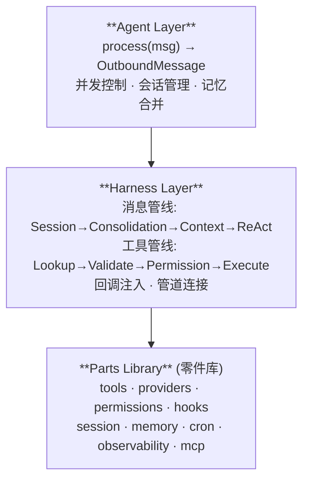
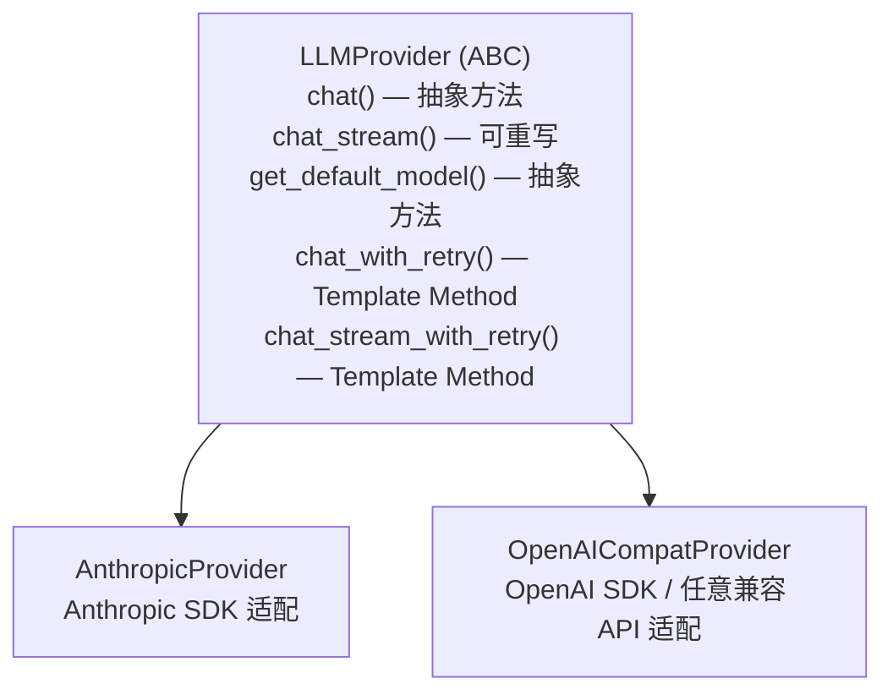
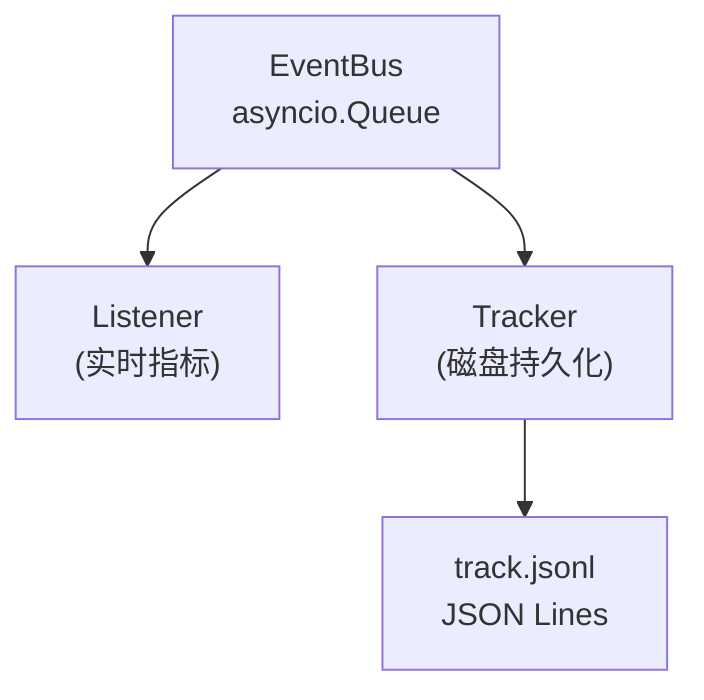

# 架构设计

## 概览

llm-harness 的核心理念可以用一个简单的公式概括：

```
Harness + LLM = Agent
```

**Harness** 是所有"非 LLM 推理"的基础设施容器——工具、权限、记忆、会话、钩子、可观测性、沙箱。它配好合理默认值，开箱即用。

**Agent** 是 Harness 加上一个模型名字，对外暴露唯一的入口方法 `process(msg)`。

整个项目约 13,000 行 Python，337 个测试，核心依赖极少，设计上追求**可读性**和**可替代性**——你可以一个下午读完，随时可以 fork 修改。

---

## 三层架构



### Agent Layer（代理层）

[`Agent`][agent-harness-agent] 是用户直接使用的类，它的职责是**编排**而非**实现**：

```python
class Agent:
    def __init__(self, harness: Harness, *, model: str, ...):
        self.harness = harness
        self.model = model
        self._consolidator = MemoryConsolidator(...)  # 仅当 memory + sessions 都启用
        self._loop = self._build_loop()               # 构建 ReAct 循环

    async def process(self, msg: InboundMessage) -> OutboundMessage | None:
        async with lock, gate:                        # 两层并发控制
            session = self.harness.sessions.get_or_create(...)  # 会话管理
            await self._consolidator.maybe_consolidate_by_tokens(...)  # 记忆合并
            messages = await self.harness.on_build_context(...)       # 构建上下文
            result = await self._loop.run_react_loop(messages)        # ReAct 循环
            self._save_turn(session, result)                          # 持久化
            return OutboundMessage(...)
```

Agent 层做的是**决策**而非**执行**：何时需要合并记忆、哪些消息需要持久化、如何控制并发。所有"怎么做"的细节都委托给 Harness 层的子系统和回调。

### Harness Layer（基座层）

[`Harness`][agent-harness-harness] 是一个基础设施容器，负责三件事：

1. **简写解析**：接受 `list[str]`、`Path`、`str` 等简写，内部解析为完整实例
2. **回调注入**：通过 `on_tool_check`、`on_build_context`、`on_error` 三个回调连接各部分
3. **默认行为**：任何组件不传时使用无操作或不安全的合理默认值

```python
harness = Harness(
    provider=my_provider,
    tools=["read_file", "exec", "web_search"],  # 简写：自动解析为 ToolRegistry
    permissions="default",                     # 简写：自动解析为 PermissionMode
    memory=Path("~/.my-agent/memory"),          # 简写：自动创建 MemoryStore
    context=[MyCustomSection()],               # 自动组装 ContextBuilder
)
```

### Parts Library（零件库）

零件库是 20+ 个独立模块的集合，每个模块有清晰的职责边界：

| 模块 | 行数（估） | 职责 |
|------|-----------|------|
| `tools/` | ~2500 | 28+ 工具注册与执行 |
| `providers/` | ~600 | LLM 提供者抽象与适配 |
| `permissions/` | ~300 | 三种权限模式 + 敏感路径 |
| `hooks/` | ~200 | 4 种钩子类型 + 生命周期 |
| `memory/` | ~400 | 双层记忆系统 |
| `session/` | ~300 | JSONL 持久化会话 |
| `observability/` | ~300 | 事件总线 + 追踪器 |
| `context/` | ~150 | System Prompt 组装 |

---

## 消息处理管线

```
User Message
    │
    ▼
┌──────────────┐
│ 1. Session    │  get_or_create(session_key)
│    get_or_create │  从磁盘加载或创建新会话
└──────┬───────┘
       ▼
┌──────────────┐
│ 2. Consolidate│  maybe_consolidate_by_tokens(session)
│    记忆合并    │  检查 token 预算，必要时压缩旧消息到 MEMORY.md
└──────┬───────┘
       ▼
┌──────────────┐
│ 3. Build      │  on_build_context(msg, history)
│    Context    │  组装 system prompt + history + current message
└──────┬───────┘
       ▼
┌──────────────┐
│ 4. ReAct Loop │  run_react_loop(messages)
│   LLM ↔ Tools │  流式/非流式调用 LLM，执行工具，反复迭代
└──────┬───────┘
       ▼
┌──────────────┐
│ 5. Persist    │  _save_turn(session, result)
│    持久化      │  保存新的 assistant/tool 消息到会话
└──────┬───────┘
       ▼
  OutboundMessage
```

这个管线并非所有步骤都必需。当 `sessions` 未配置时，步骤 1、2、5 完全跳过，Agent 运行在**无状态模式**。这与 "显式优于隐式" 的设计哲学一致——用户只为自己需要的功能付费（在复杂度上）。

---

## 工具执行管线

```
LLM 决定调用工具
    │
    ▼
┌────────────────┐
│ Lookup         │  harness.tools.get(tool_name)
│ 工具查找        │  返回 BaseTool 实例或 None
└──────┬─────────┘
       ▼
┌────────────────┐
│ Validate       │  tool.input_model.model_validate(args_dict)
│ 参数验证        │  Pydantic 自动校验参数类型和约束
└──────┬─────────┘
       ▼
┌────────────────┐
│ Permission     │  harness.on_tool_check(tool_name, tool, parsed)
│ 权限检查        │  3 种模式 + 敏感路径 + 命令黑名单
└──────┬─────────┘
       ▼
┌────────────────┐
│ Hook (PRE)     │  HookEvent.PRE_TOOL_USE
│ 前置钩子        │  command / prompt / http / agent 四种类型
└──────┬─────────┘
       ▼
┌────────────────┐
│ Execute        │  tool.execute(parsed, context)
│ 工具执行        │  async 执行 + 超时处理 + CancelledError 传播
└──────┬─────────┘
       ▼
┌────────────────┐
│ Hook (POST)    │  HookEvent.POST_TOOL_USE
│ 后置钩子        │  审计日志 / 通知
└──────┬─────────┘
       ▼
┌────────────────┐
│ Return to LLM  │  结果截断到 16K 字符 + 错误格式化为 Error: ...
│ 返回 LLM        │  错误不会中断循环，仅标记 is_error
└────────────────┘
```

关于工具管线的完整代码级解读，见[工具执行管线](./pipeline.md)。

---

## Provider 抽象层（Template Method 模式）

LLM Provider 使用经典的 **Template Method** 设计模式：



为什么选择 Template Method 而非 Strategy 或 Adapter？

- **重试逻辑集中管理**：`chat_with_retry()` 和 `chat_stream_with_retry()` 的退避策略、瞬态错误判断、图片降级逻辑完全一致
- **子类只管一件事**：实现 `chat()` 和 `get_default_model()` 即可，不需要关心重试
- **支持按需覆盖**：`chat_stream()` 默认回退到非流式，但 `OpenAICompatProvider` 可以覆盖为原生流式实现

```python
# LLMProvider 的核心模板方法
async def chat_with_retry(self, messages, tools, ...):
    for attempt, delay in enumerate(self._CHAT_RETRY_DELAYS, start=1):
        response = await self._safe_chat(messages=messages, tools=tools, ...)
        if response.finish_reason != "error":
            return response
        if not self._is_transient_error(response.content):
            # 非瞬态错误：尝试去掉图片重试一次
            stripped = self._strip_image_content(messages)
            if stripped:
                return await self._safe_chat(messages=stripped, ...)
            return response
        await asyncio.sleep(delay)
    return await self._safe_chat(...)
```

Provider 注册采用**自动检测**机制：[`Registry`][agent-harness-providers-registry] 根据 model 名称、api_key 格式和 api_base 推断应该使用哪个后端：

```python
spec = detect_provider(model, api_key=key, api_base=base)
# → ProviderSpec(backend="anthropic", ...)
# → ProviderSpec(backend="openai_compat", ...)
```

这使得用户通常只需要传一个 `model="gpt-4"`，系统自动选择正确的 Provider。

---

## 观测系统（EventBus）

观测系统是一个三层的 **Publish-Subscribe** 架构：



**为什么需要三层？**

- **事件类型统一**：17 种结构化事件（`LoopEvent` + `SystemEvent`），统一走 `EventBus.emit(event)`
- **生产-消费解耦**：生产者不需要知道谁在消费，消费者不需要修改生产者代码
- **零开销默认**：没有 `Tracker` 时 `EventBus` 从不创建，`emit()` 是无操作的

```python
# 在任何模块中推送事件
from agent_harness.observability.events import ToolExecutionStarted
from agent_harness.observability.bus import emit

await emit(ToolExecutionStarted(tool_name="exec", tool_input={"command": "ls"}))
# Tracker 自动将其序列化为 JSON Lines
# → {"type": "ToolExecutionStarted", "ts": "...", "data": {"tool_name": "exec", ...}}
```

17 种事件类型分为两类：

- **Loop 事件**：`AssistantTextDelta`、`AssistantTurnComplete`、`ToolExecutionStarted`、`ToolExecutionCompleted`、`ErrorEvent`、`StatusEvent`
- **系统事件**：`SessionOpened`、`SessionClosed`、`SubagentSpawned`、`SubagentCompleted`、`CronJobTriggered`、`CronJobCompleted`、`MemoryConsolidated`、`McpConnectionChanged`、`PluginLoaded`、`ConfigChanged`

---

## 模块依赖关系

```
Agent
  │
  ├── Harness
  │     ├── LLMProvider (Template Method)
  │     ├── ToolRegistry (28+ 工具)
  │     ├── PermissionChecker (3 种模式 + 敏感路径)
  │     ├── ContextBuilder (SectionProvider 插件化)
  │     ├── MemoryStore (双层记忆)
  │     ├── SessionManager (JSONL 持久化)
  │     ├── HookRegistry (4 种类型)
  │     ├── SkillRegistry (skills 注入)
  │     └── Tracker (事件总线消费者)
  │
  ├── AgentLoop (ReAct 骨架)
  │     └── LoopCallbacks (回调注入)
  │
  └── MemoryConsolidator
        └── MemoryStore.consolidate() (LLM 驱动合并)
```

箭头方向体现了**单向依赖**原则：
- `Agent` 依赖于 `Harness` 和 `AgentLoop`，但后者不依赖前者
- `Harness` 是纯容器，不依赖 `Agent` 或 `AgentLoop`
- 各零件之间通过接口交互，不直接引用实现

这使得每个模块都可以独立测试、独立替换。例如你可以完全替换掉 `AgentLoop` 而仍然使用所有的 Harness 零件。

---

## 与 LangChain 的架构对比

| 维度 | llm-harness | LangChain |
|------|------------|-----------|
| **代码量** | ~13,000 行 | 300,000+ 行 |
| **核心依赖** | minimal（Pydantic + httpx + tzdata） | 50+ 子包，每个有自己的依赖树 |
| **设计模式** | 回调注入 + Template Method | Chain + Runnable + 多层抽象 |
| **学习曲线** | 读 3 个核心文件可理解全貌 | 需要理解 LCEL、Runnable、ChatModels、Tools 等 |
| **定制方式** | fork 修改，代码量小 | 继承/组合框架类 |
| **可观测性** | 内建 EventBus + Tracker | LangSmith（外部服务） |
| **并发模型** | asyncio Lock + Semaphore | 无内建并发控制 |
| **持久化** | 文件系统 JSONL | 无默认持久化 |
| **扩展性** | 通过零件替换 | 通过插件和 Runnable |

两者的根本分歧在于哲学：

- **LangChain** 是一个**编排框架**——它定义了一种范式（Chains 或 Runnable），要求你按照它的方式组织代码。好处是生态丰富，代价是学习成本和高耦合。
- **llm-harness** 是一个**基础设施基座**——它提供你构建 Agent 所需的一切零件，但不规定你如何编排它们。你可以用 `AgentLoop`，也可以完全自己写循环，Harness 的零件仍然有用。

这种分歧在代码量上最直观：LangChain 的 `langgraph` 包本身就有 ~50,000 行代码，比整个 llm-harness 还大几倍。

[agent-harness-agent]: ../api/agent.md
[agent-harness-harness]: ../api/harness.md
[agent-harness-providers-registry]: ../api/providers.md
