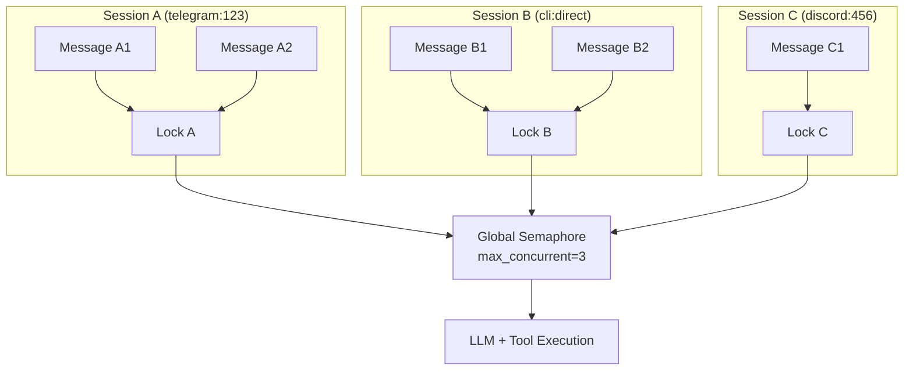
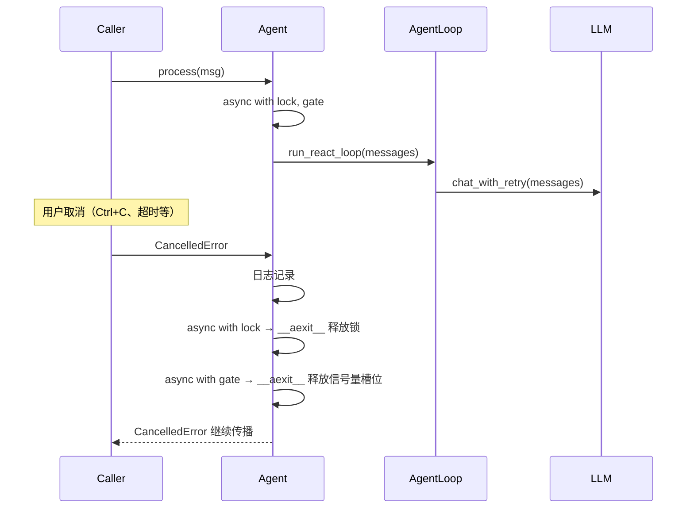

# 并发模型

在 Agent 框架中加入并发控制，看起来是一件"简单"的事情——加上 `asyncio.Lock` 不就行了？但实际上，并发控制的设计需要平衡三个相互冲突的目标：

1. **会话隔离**：同一会话的消息不能并行处理（会乱序）
2. **全局吞吐**：不同会话的消息应该能并行处理
3. **资源保护**：LLM API 和工具执行不能无限并发

llm-harness 使用**两层并发控制**来满足这三个目标。

---

## 两层并发控制

```python
class Agent:
    def __init__(self, ...):
        self._session_locks: dict[str, asyncio.Lock] = {}
        self._concurrency_gate = (
            asyncio.Semaphore(max_concurrent) if max_concurrent > 0 else None
        )

    async def process(self, msg: InboundMessage) -> OutboundMessage | None:
        lock = self._session_locks.setdefault(msg.session_key, asyncio.Lock())
        gate = self._concurrency_gate or nullcontext()

        async with lock, gate:        # ← 两层：先取会话锁，再取全局信号量
            ...
```



### 第一层：Per-Session Lock

```python
lock = self._session_locks.setdefault(msg.session_key, asyncio.Lock())
```

- 每个 `session_key`（格式 `channel:chat_id`）维护一个独立的 `asyncio.Lock`
- 同一会话的消息**串行**处理
- 不同会话的消息**并行**处理

为什么是 `setdefault` 而不是先检查再创建？因为 `setdefault` 是原子的——两个并发的 `process()` 调用不会创建两个 Lock 实例。`_session_locks` 是一个普通 dict，但由于 `setdefault` 本身是 CPython 的原子操作（GIL 保护），不会出现竞态条件。

### 第二层：Global Semaphore

```python
self._concurrency_gate = asyncio.Semaphore(max_concurrent)
```

- 全局信号量，限制同时运行的处理数量
- 默认 `max_concurrent=3`
- 设为 `0` 或负数时，信号量行为禁用（不限制并发）

---

## 为什么需要两层

如果只有 per-session Lock：

```
Session A 有 10 条并发请求
Session B 有 1 条请求
         ↓
Session A 占用 10 个 asyncio 任务
Session B 等待所有 A 的任务释放
         ↓
10 个 LLM API 调用同时发生
→ API rate limit 被触发
→ 所有请求因重试而进一步变慢
```

如果只有 global Semaphore：

```
Session A 的消息 A1 正在处理
Session B 的消息 B1 正在处理
         ↓
A2 到达 → Semaphore 允许 → 开始处理
         ↓
A1 和 A2 同时操作同一个 session
→ 历史消息乱序
→ get_history() 返回错误的数据
→ LLM API 调用中出现孤立的 tool result
```

两层控制结合后才完美：

1. **Lock 保证会话内有序**：A1、A2 串行，不会交叉污染
2. **Semaphore 保证全局不超载**：3 个并发的任务不会触发 rate limit
3. **非活跃会话不占用锁**：Lock 在 `_session_locks` dict 中按需创建，不活跃会话的锁不会阻塞其他会话

```
时间线              Session A          Session B          Session C
                    Lock A             Lock B             Lock C
                    ↓                  ↓                  ↓
                    Semaphore (max=3)
                    ↓                  ↓                  ↓
t=0                 A1 enter           B1 enter           C1 enter
t=1                 A1 processing      B1 processing      C1 processing
t=2                 A2 arrives         B2 arrives
t=3                 (A2 waits Lock A)  (B2 waits Lock B)
t=4                 A1 done            B1 done
t=5                 A2 enter           B2 enter
t=6                 A2 processing      B2 processing
```

注意：A2 等待的是 Lock A，不是 Semaphore。只有当 A1 完成时 A2 才获得 Lock A。但 B1 和 A1 同时运行时，A2 不需要等待 B1——它只被同一个 session 的 A1 阻塞。

---

## Agent.process() 中的并发控制

```python
async def process(self, msg: InboundMessage) -> OutboundMessage | None:
    lock = self._session_locks.setdefault(msg.session_key, asyncio.Lock())
    gate = self._concurrency_gate or nullcontext()

    async with lock, gate:
        try:
            ...
            result = await self._loop.run_react_loop(initial_messages, ...)
            ...
        except asyncio.CancelledError:
            logger.info("Task cancelled for session %s", msg.session_key)
            raise
        except Exception as exc:
            user_msg = await self.harness.on_error(exc, "agent.process")
            ...
```

值得注意的设计点：

### 1. Lock 和 Gate 的获取顺序

`async with lock, gate` 等价于：

```python
async with lock:
    async with gate:
        ...
```

Lock 总是在 Gate 之前获取。这保证了：如果一个会话已经有消息在处理，新到达的消息被 Lock 阻塞，而不是消耗 Semaphore 的槽位。否则，Semaphore 会被等待的会话耗尽，没有进展。

### 2. nullcontext 优化

```python
gate = self._concurrency_gate or nullcontext()
```

当 `max_concurrent=0`（无限制）时使用 `contextlib.nullcontext()` 作为无操作上下文管理器——它不会阻塞，也没有任何性能开销。这比 `if gate: ...` 的条件写法更简洁，因为 `async with` 统一处理了两种情况。

### 3. CancelledError 的显式处理

`CancelledError` 不被 `Exception` 捕获。这是 asyncio 规范要求的行为：

- `asyncio.CancelledError` 继承自 `BaseException`，不是 `Exception`
- 必须重新抛出以确保上层可以检测到取消
- 锁会被 `async with` 的 `__aexit__` 自动释放——不需要手动释放

```python
except asyncio.CancelledError:
    raise  # Lock 和 Gate 的 __aexit__ 会自动执行
```

---

## AgentLoop 的并发 vs Agent 的并发

`AgentLoop` 也有自己的并发控制：

```python
class AgentLoop:
    def __init__(self, ...):
        self._session_locks: dict[str, asyncio.Lock] = {}
        self._concurrency_gate = (
            asyncio.Semaphore(max_concurrent) if max_concurrent > 0 else None
        )
```

但注意 `Agent._build_loop()` 中：

```python
def _build_loop(self) -> AgentLoop:
    ...
    return AgentLoop(
        provider=harness.provider,
        callbacks=callbacks,
        model=self.model,
        max_iterations=self.max_iterations,
        max_concurrent=0,       # ← AgentLoop 层面不限制并发
    )
```

`Agent` 将自己的 `max_concurrent` 设置为 `0`，将并发控制从 AgentLoop 提升到 Agent 层面。为什么？

### 职责分离

- **Agent** 负责完整的消息处理管线：会话管理、记忆合并、上下文构建→运行→持久化。它在调用 `run_react_loop` 之前就获取了锁和信号量。
- **AgentLoop** 只负责 ReAct 循环的迭代逻辑。它不应关心并发控制，因为它只在其上层已经获取锁之后运行。

如果你直接使用 `AgentLoop`（跳过 `Agent`），它的并发控制就起作用了。`AgentLoop.process_message()` 和 `AgentLoop.process_direct()` 提供了两种不同的使用方式：

- `process_message()` 处理完整的消息 → 使用 per-session Lock + global Semaphore
- `process_direct()` 一次性调用 → 不获取任何锁，由调用方负责

```python
# 直接使用 AgentLoop —— 调用方自己管理并发
loop = AgentLoop(provider, callbacks, max_concurrent=5)
result = await loop.process_direct("Hello!")  # 无锁
```

---

## Semaphore 默认值（3）的选择

为什么默认 `max_concurrent=3`？不是 1、不是 5、不是 10？

### 三种约束的平衡

| 约束 | 限制 |
|------|------|
| **LLM API Rate Limit** | 大多数 tier 允许 3-5 RPM (requests per minute) |
| **LLM API 并发限制** | 大多数 API 允许 3-5 并发 |
| **工具执行开销** | 每个并发的 Agent 调用会执行多个工具，每个工具都有 I/O 等待 |
| **上下文窗口** | 多个并发 Agent 每个都使用几千到几万 token |

### 为什么不是 1

如果 `max_concurrent=1`，那么所有会话完全串行——Session A 在等待 LLM 响应时，Session B 也必须等待。LLM API 调用是 I/O 密集型的（等待网络响应），串行化会导致显著的吞吐量损失。

### 为什么不是 5+

`max_concurrent=5` 通常不会触发 rate limit，但在边缘情况下可能。如果你的 Agent 经常执行 `exec` 或 `web_search` 等耗时的工具，5 个并发 Agent 可能同时产生 10+ 个工具调用，这取决于 LLM API 的限制。

### 3 是一个安全的默认值

- 大多数 LLM API 的免费/标准 tier 允许至少 3 个并发请求
- 大多数 rate limit 设置允许每分钟 3-5 个请求，并发 3 通常不会触发
- 如果你的 Application 需要更高吞吐量，`max_concurrent` 是可配置的

```python
# 高吞吐部署
agent = Agent(
    Harness(provider=provider, ...),
    model="gpt-4",
    max_concurrent=10,  # 需要 API tier 支持
)
```

---

## CancelledError 处理



CancelledError 的传播路径是：

1. 用户或外部系统发起取消（`asyncio.Task.cancel()`、超时、关闭事件循环）
2. `CancelledError` 被注入到 await 点
3. `Agent.process()` 中的 `except asyncio.CancelledError` 捕获并记录日志
4. `raise` 重新抛出
5. `async with lock, gate` 的 `__aexit__` 在异常传播过程中自动执行 → 锁和信号量被释放

### 为什么需要 raise

如果你在 `except asyncio.CancelledError` 中返回了一个 `OutboundMessage`：

```python
except asyncio.CancelledError:
    return OutboundMessage(  # ← 错误做法
        content="Task was cancelled, but here's a partial result"
    )
```

这就**吞掉了取消信号**。asyncio 的事件循环无法知道你处理了取消，可能导致：

- 任务不被视为已取消（`task.cancelled()` 返回 `False`）
- 内存泄露（cancel() 的调用方会永远等待任务完成）
- 资源泄露（锁可能无法正确恢复）

正确的做法是：记录、清理、重新抛出。

---

## 总结

llm-harness 的并发模型通过两层控制实现了一个重要的设计目标：**可预测的、资源友好的并行处理**。

| 机制 | 解决的问题 | 范围 |
|------|-----------|------|
| Per-session Lock | 会话内消息顺序 | 每 session |
| Global Semaphore | 总并发限制 | 每 Agent 实例 |
| CancelledError 显式传播 | 确保取消正确、资源释放 | 全局 |

这三者共同确保了：

- 同一会话的两个消息不会交叉处理
- 不同会话的消息合理共享资源
- 取消操作不会导致锁或资源泄露
- 默认配置开箱即用，极少需要调整
