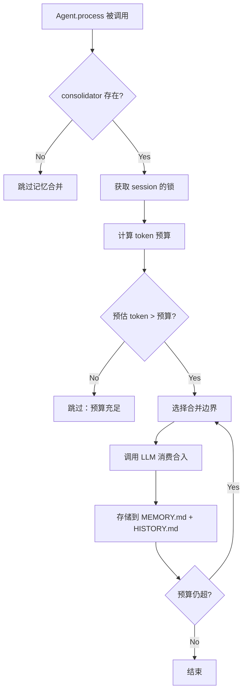
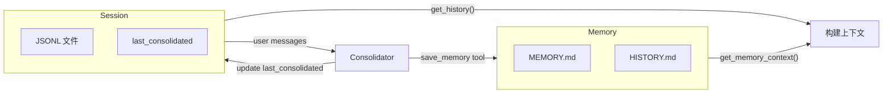

# 记忆模型

llm-harness 没有实现"让 LLM 记住一切"——那是模型能力的范畴。它实现的是**让 Agent 在持久化数据中保持对重要事实和历史的可访问性**。

记忆系统的核心设计选择是：**不引入新的存储引擎**。所有数据存储在文件系统中，格式为 Markdown（人类可读）和 JSONL（机器高效）。

---

## 双层记忆：MEMORY.md + HISTORY.md

```
~/.agent-harness/
├── memory/
│   ├── MEMORY.md          ← 长期事实（不断更新）
│   └── HISTORY.md         ← 可搜索的历史日志（append-only）
└── sessions/
    ├── cli_direct.jsonl   ← 原始对话历史
    └── telegram_12345.jsonl
```

### MEMORY.md：长期事实

存储"Agent 应该长期记住的事情"。内容完全由 LLM 在记忆合并过程中产生：

```markdown
<!-- MEMORY.md 示例 -->
## 用户偏好
- 用户使用 vim 作为编辑器
- 用户工作目录在 ~/projects/my-app
- 用户偏好 Python 3.12+

## 项目状态
- 当前在 my-app 分支 feature/auth 上工作
- API 认证使用 JWT，密钥在 .env 中
```

格式完全是自由的 Markdown。没有任何 Schema 约束。这是因为：

1. **记忆的内容是不可预测的**：你无法提前知道 Agent 需要记住什么
2. **LLM 擅长生成自由格式的文本摘要**：强制 LLM 填 Schema 会丢失信息
3. **人类可读**：你可以打开 MEMORY.md 直接读取和编辑

### HISTORY.md：可搜索日志

每条记录包含时间戳和文本摘要，格式固定便于 `grep` 搜索：

```markdown
[2026-05-24 10:15] USER: 帮我写一个 FastAPI 应用
[2026-05-24 10:16] ASSISTANT[tools: web_search, read_file]: 搜索并读取了 FastAPI 文档
[2026-05-24 10:18] ASSISTANT: 完成了一个 FastAPI 应用的骨架代码
```

HISTORY.md 是**append-only**的——一旦写入就不会被修改。它作为一种"粗粒度搜索索引"而存在：当用户说"之前那个认证功能"，Agent 可以在 HISTORY.md 中 `grep` 找到相关对话的摘要和时间点。

---

## MemoryConsolidator：何时以及如何合并



### 触发条件：Token 预算

```python
budget = context_window_tokens - max_completion_tokens - SAFETY_BUFFER
# 示例：context_window=128K, max_completion=8K, safety_buffer=1K
#     → budget = 119K
# 当预估 token > budget 时，触发合并
# 目标是将预估 token 压缩到 budget / 2 以下
```

具体公式：

$$budget = C - M - S$$

其中 $C$ 是上下文窗口大小，$M$ 是最大生成长度，$S$ 是安全缓冲区（1024 tokens）。$S$ 的存在是因为 token 估算是不精确的——基于字符数/4 的估算可能偏差 20-30%，安全缓冲区确保实际的 API 调用不会因估算偏差而超过上下文窗口。

目标值 `budget // 2` 是一个经验值——压缩到一半以下，避免频繁触发合并。

### 合并过程

```python
async def maybe_consolidate_by_tokens(self, session: Session) -> None:
    if not session.messages or self.context_window_tokens <= 0:
        return

    lock = self.get_lock(session.key)  # 每会话独占锁
    async with lock:
        budget = self.context_window_tokens - self.max_completion_tokens - self._SAFETY_BUFFER
        estimated, source = await self.estimate_session_prompt_tokens(session)

        if estimated >= budget:
            # 触发合并：选择用户消息边界，调用 LLM 消费，更新 last_consolidated
            boundary = self.pick_consolidation_boundary(session, ...)
            chunk = session.messages[session.last_consolidated : boundary]
            await self.consolidate_messages(chunk)
            session.last_consolidated = boundary
```

选择合范围的边界是一个用户消息边界：

```python
def pick_consolidation_boundary(self, session, tokens_to_remove):
    start = session.last_consolidated
    for idx in range(start, len(session.messages)):
        message = session.messages[idx]
        if idx > start and message.get("role") == "user":
            last_boundary = (idx, removed_tokens)   # ← 用户消息交界处
            if removed_tokens >= tokens_to_remove:
                return last_boundary
```

为什么按用户消息边界切割？因为工具调用链是原子性的——你不想在 `assistant` 调用 `read_file` 获取文件内容后、但在 `exec` 执行前切割。如果工具调用链被分割，后续的 LLM 调用会看到无上下文的 tool result，可能导致幻觉。

### LLM 合并：save_memory 工具

合并的核心是调用 LLM 的 `save_memory` 工具。这是一个强制（forced）工具调用：

```python
_SAVE_MEMORY_TOOL = [{
    "type": "function",
    "function": {
        "name": "save_memory",
        "description": "Save memory consolidation result to persistent storage.",
        "parameters": {
            "properties": {
                "history_entry": {
                    "description": "Key events summary, start with [YYYY-MM-DD HH:MM]"
                },
                "memory_update": {
                    "description": "Full updated long-term memory as markdown"
                }
            },
            "required": ["history_entry", "memory_update"]
        }
    }
}]
```

LLM 被要求返回两个字段：

- **`history_entry`**：自然语言摘要，格式为 `[YYYY-MM-DD HH:MM] ...`，用于追加到 `HISTORY.md`
- **`memory_update`**：完整的 MEMORY.md 内容。如果和现有 MEMORY.md 相同，LLM 应返回不变的内容

这是 LLM 驱动记忆合并的核心设计——我们相信 LLM 善于总结，而不需要人为编写合并算法。

### 为什么使用强制 tool_choice

```python
forced = {"type": "function", "function": {"name": "save_memory"}}
response = await provider.chat_with_retry(
    messages=chat_messages,
    tools=_SAVE_MEMORY_TOOL,
    tool_choice=forced,
)
```

强制 tool_choice 确保 LLM 只输出结构化的合并结果，而不是闲聊。如果提供者不支持强制 tool_choice（一些兼容性 API），系统会检测到错误并自动回退到 `"auto"`：

```python
if response.finish_reason == "error" and _is_tool_choice_unsupported(response.content):
    response = await provider.chat_with_retry(..., tool_choice="auto")
```

---

## Raw-Archive 降级

```python
class MemoryStore:
    _MAX_FAILURES_BEFORE_RAW_ARCHIVE = 3

    def _fail_or_raw_archive(self, messages: list[dict]) -> bool:
        self._consecutive_failures += 1
        if self._consecutive_failures < self._MAX_FAILURES_BEFORE_RAW_ARCHIVE:
            return False
        self._raw_archive(messages)
        self._consecutive_failures = 0
        return True
```

当 LLM 合并连续失败 3 次后，系统进入**降级模式**：放弃 LLM 摘要，直接将原始消息原样 dump 到 `HISTORY.md`：

```markdown
[2026-05-24 10:20] [RAW] 12 messages
[2026-05-24 10:15] USER: 帮我优化这段代码...
[2026-05-24 10:16] ASSISTANT[tools: read_file]: 让我先看看文件内容...
...
```

为什么设计降级而不是持续报错？

1. **合并不能永久阻塞**：Agent 不能因为记忆合并失败而无法继续工作
2. **原始数据比空数据好**：即使没有 LLM 摘要，原始消息作为可搜索的归档也比直接丢弃要好
3. **自我恢复**：下次周期性合并将使用原始归档作为上下文的一部分，LLM 合并仍可能成功

---

## Session 与 Memory 的协作



### 分工

- **Session**（JSONL）：存储完全的、未经过滤的对话历史。每个消息包括 role、content、timestamp、tool_calls 等完整字段。用于从上下文中恢复最近的历史（`get_history(max_messages=500)`）。
- **Memory**（Markdown）：存储经过 LLM 压缩摘要的长期事实（MEMORY.md）和时间线（HISTORY.md）。用于在系统 prompt 中注入背景知识。

### 为什么保留两份

为什么不让 Session 直接存储所有内容？为什么要同时维护 Session 和 Memory 两套系统？

1. **保留原始数据**：LLM 可能错误地合并或遗漏重要信息。原始 Session 数据可用于事后审计或重新合并。
2. **搜索粒度**：MEMORY.md 最适合"用户偏好"这类全局事实，HISTORY.md 最适合 grep 搜索，Session JSONL 最适合恢复精确上下文。三种需求需要不同的数据格式。
3. **关注点分离**：Session 负责上下文恢复，Memory 负责长期记忆。一个的变更不应对另一个产生副作用。

---

## 合法边界对齐（_find_legal_start）

```python
@staticmethod
def _find_legal_start(messages: list[dict[str, Any]]) -> int:
    """Find first index where every tool result has a matching assistant tool_call."""
    declared: set[str] = set()
    start = 0
    for i, msg in enumerate(messages):
        if msg.get("role") == "assistant":
            for tc in msg.get("tool_calls") or []:
                if tc.get("id"):
                    declared.add(str(tc["id"]))
        elif msg.get("role") == "tool":
            tid = msg.get("tool_call_id")
            if tid and str(tid) not in declared:
                # Orphan tool result: skip past it
                start = i + 1
                declared.clear()
    return start
```

### 问题

LLM API 的 message 列表有一个严格约束：每个 `role: "tool"` 消息必须有一个对应的 `role: "assistant"` 消息在其前面，且该 assistant 消息包含 `tool_calls` 中对应 ID 的声明。

当 `get_history(max_messages=500)` 从历史中截取最近的 500 条消息时，可能出现：

```
起始边界
  ↓
[tool] "file content..."          ← 孤立的 tool result——前面的
  [assistant] "让我检查代码..."     ← 对应的 assistant 被切掉了
  [user] "然后呢？"
```

某些 LLM API（尤其是 OpenAI）会因"孤立的 tool result"而拒绝调用。`_find_legal_start` 解决这个问题：它扫描历史并从第一个"user 消息"处重新对齐，确保截断只发生在安全的边界。

### 为什么需要 staticmethod 而不是在 get_history 中直接做

因为 `get_history()` 已经被压缩过的历史中可能出现同样的问题。当 `Session.retain_recent_legal_suffix()` 被调用（例如压缩会话时），它也要使用相同的边界逻辑：

```python
def retain_recent_legal_suffix(self, max_messages: int) -> None:
    sliced = self.messages[start_idx:]        # 基于 user 边界
    start = self._find_legal_start(sliced)    # 合法化检查
    if start:
        sliced = sliced[start:]
    self.messages = sliced
```

---

## 未来扩展

当前记忆系统使用文件系统作为唯一后端。架构上为向量记忆预留了扩展空间：

### 可能的接入点

1. **Mem0**：在 `MemoryStore.consolidate()` 中增加向量嵌入步骤，将生成的 `memory_update` 同时存入 Mem0 的长期记忆
2. **ChromaDB**：在 `ContextBuilder` 层面增加一个 SectionProvider，查询 ChromaDB 语义相关片段注入系统 prompt
3. **混合记忆**：MEMORY.md 保留事实性信息，向量数据库管理语义相似度，HISTORY.md 保留时间线搜索

### 为什么现在不做

1. **复杂度代价**：引入向量数据库会显著增加依赖和部署复杂度
2. **不确定的收益**：对于大多数 Agent 使用场景（文件操作、代码编写、工具调用），基于文本的 grep/Markdown 记忆已经足够
3. **架构灵活性**：`ContextBuilder` 的 `SectionProvider` 机制使得任何形式的记忆都可以作为"一段文本"注入系统 prompt——不限制后端

```python
class VectorMemorySection(SectionProvider):
    """未来扩展：向量记忆作为系统 prompt 的一部分"""
    @property
    def section_name(self) -> str:
        return "vector_memory"

    async def get_section(self) -> str:
        results = await chroma_db.query(query, top_k=5)
        return f"## Related Memories\n{results}"

# 使用
builder = ContextBuilder()
builder.add_provider(VectorMemorySection())  # 一行代码集成
```
