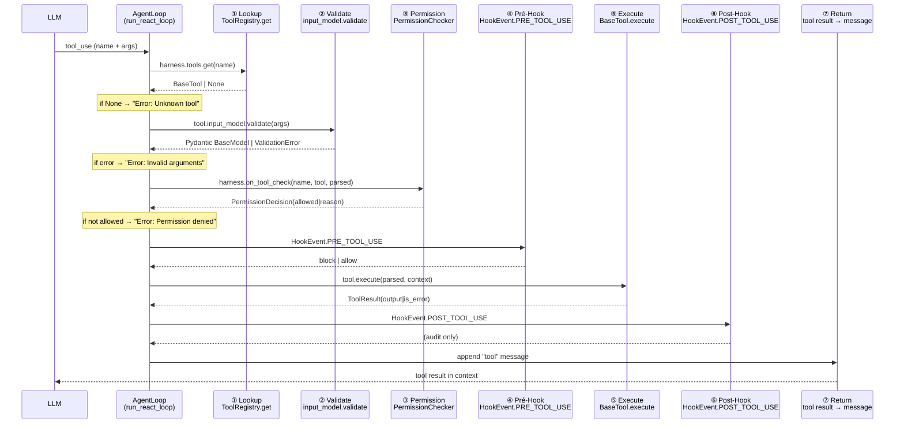
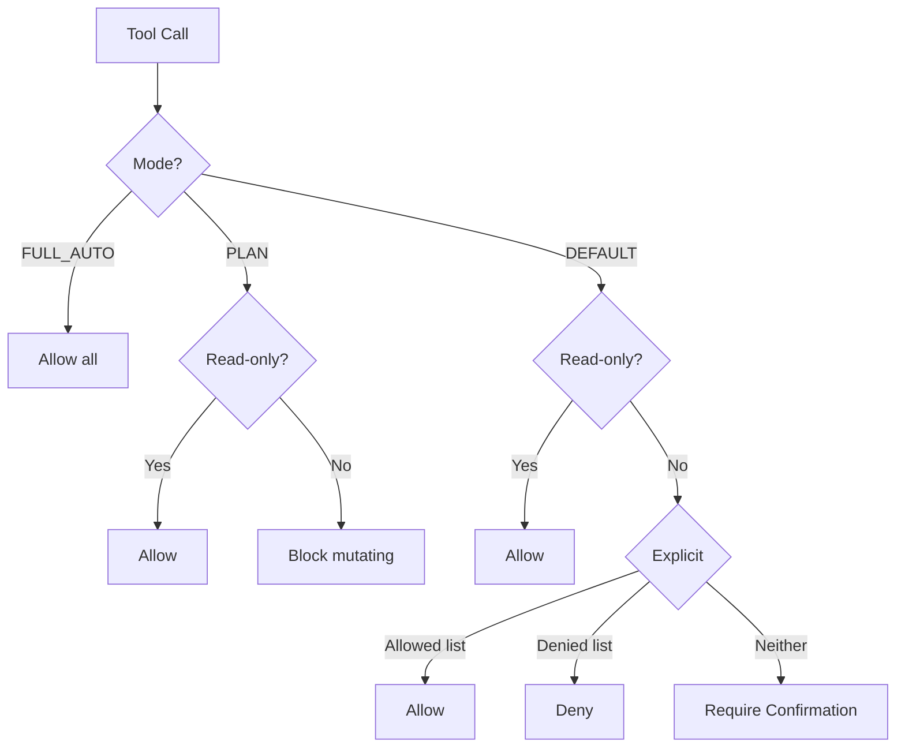

# 工具执行管线

当 LLM 决定调用一个工具时，数据流经过一条精心设计的管线。本文档逐层拆解这个管线的每一步，解释"为什么这样设计"以及"每一步在做什么"。

---

## 完整管线



每一步都有明确的职责：**查不到就返回错误、参数非法就返回错误、权限不足就返回错误**。错误从来不终止循环——它作为结果字符串回到 LLM 的消息列表，让 LLM 自己决定下一步做什么。

---

## ① Lookup：工具查找

```python
tool = harness.tools.get(tool_name)
if tool is None:
    return f"Error: Unknown tool '{tool_name}'"
```

[`ToolRegistry`][agent-harness-tools-base-toolregistry] 是一个名称到 `BaseTool` 实例的映射。28+ 工具的注册发生在 Harness 构建时。

### 为什么允许多个同名工具被覆盖

`ToolRegistry.register()` 使用 `tool.name` 作为键：

```python
class ToolRegistry:
    def register(self, tool: BaseTool) -> None:
        self._tools[tool.name] = tool
```

这意味着如果同一个名字注册了两次，后者会覆盖前者。这种设计是有意的——它允许用户在 Harness 构造后替换任何工具的行为：

```python
harness.tools.register(MyCustomExecTool())  # 替换内置的 exec 工具
```

### 查找失败的处理

"Unknown tool" 不是异常，而是作为错误消息字符串返回。这确保 LLM 能看到反馈并可能纠正自己的行为——它可能打错了工具名。

---

## ② Validate：参数验证

```python
try:
    parsed = tool.input_model.model_validate(args_dict)
except Exception as exc:
    return f"Error: Invalid arguments for '{tool_name}': {exc}"
```

### Pydantic 做了什么

每一个 `BaseTool` 子类声明一个 `input_model`，这是一个继承自 `pydantic.BaseModel` 的类：

```python
class GlobInput(BaseModel):
    pattern: str = Field(description="Glob pattern to search")
    path: str | None = Field(None, description="Base directory")

class GlobTool(BaseTool):
    name = "glob"
    input_model = GlobInput
```

当 LLM 返回参数时，`model_validate(args_dict)` 完成：

- **类型检查**：`pattern` 必须是 `str`，`path` 可以省略或为 `str`
- **默认值填充**：`path` 默认为 `None`
- **额外字段过滤**：LLM 可能返回未定义的字段，它们会被静默丢弃
- **描述性错误**：参数类型错误时Pydantic提供清晰的错误消息

```python
# LLM 返回：{"pattern": 123, "path": "/tmp"}
# Pydantic 校验：
# → ValidationError: Input should be a valid string [type=string_type, ...
# 用户看到：Error: Invalid arguments for 'glob': 1 validation error for GlobInput
#   pattern: Input should be a valid string
```

这也是对比[手写 JSON Schema 方案](design-decisions.md)的核心优势：不再有"C 风格"的类型检查和每次都需要手动维护校验代码的工作量。

---

## ③ Permission：权限检查

```python
permission = await harness.on_tool_check(tool_name, tool, parsed)
if not permission.allowed:
    return f"Error: Permission denied: {permission.reason}"
```

### 三种权限模式

[`PermissionChecker`][agent-harness-permissions-checker] 支持三种模式，由 `PermissionSettings.mode` 控制：



| 模式 | 适用场景 | 行为 |
|------|---------|------|
| `FULL_AUTO` | 生产环境、可信 LLM | 所有调用自动放行 |
| `PLAN` | 规划阶段 | 只允许只读工具（read_file、glob 等） |
| `DEFAULT` | 日常使用 | 只读工具自动放行；修改工具需用户确认 |

### 敏感路径保护

始终生效的安全机制，不受模式影响。`SENSITIVE_PATH_PATTERNS` 硬编码了一个路径黑名单：

```python
SENSITIVE_PATH_PATTERNS = (
    "*/.ssh/*",
    "*/.aws/credentials",
    "*/.config/gcloud/*",
    "*/.kube/config",
    "*/.agent-harness/credentials.json",
    ...
)
```

当工具调用涉及文件路径时，`PermissionChecker.evaluate(file_path=...)` 会做 fnmatch 匹配。这层保护是**不可配置的**——不依赖用户是否正确配置了权限模式，也无法通过用户设置关闭。这是深度防御策略的一部分：

> LLM 可能被提示注入诱导读取 SSH 密钥。敏感路径保护是最后的防线——即使权限模式是 `FULL_AUTO`，即使工具在白名单中，对 `.ssh/id_rsa` 的读取也会被阻止。

### 命令黑名单

除了路径保护，还有基于 `denied_commands` 模式的黑名单，专门针对 shell 执行：

```python
# settings.json
{
    "permissions": {
        "denied_commands": ["rm -rf /*", "shutdown*", "dd if=*"]
    }
}
```

---

## ④ Pré-Hook：前置钩子

在工具实际执行之前，系统检查是否有注册在 `HookEvent.PRE_TOOL_USE` 事件上的钩子。

llm-harness 支持四种钩子类型：

| 类型 | 用途 | 超时 | 阻塞行为 |
|------|------|------|---------|
| `command` | 执行 Shell 命令检查环境 | 30s | 默认不阻塞 |
| `prompt` | 要求 LLM 验证条件 | 30s | 默认阻塞 |
| `http`  | POST 事件到外部端点 | 30s | 默认不阻塞 |
| `agent` | LLM 深度合规审查 | 60s | 默认阻塞 |

```json
{
    "pre_tool_use": [
        {
            "type": "http",
            "url": "http://audit.internal/tool-check",
            "block_on_failure": true
        },
        {
            "type": "prompt",
            "prompt": "Check if a file containing secrets should be read"
        }
    ]
}
```

### 为什么要有钩子

钩子系统提供了权限系统之外的**第二层判定**。权限系统是静态的（模式 + 规则），钩子是动态的（实时检查 + AI 判定）。

- **Command Hook**：在 `exec` 之前运行 `df -h` 检查磁盘空间是否足够
- **Prompt Hook**：询问 LLM "是否应该允许读取这个敏感文件？"
- **HTTP Hook**：调用外部审批系统，检查该操作是否需要人工批准
- **Agent Hook**：启动一个独立的 Agent 调用，做深度的合规和语义审查

---

## ⑤ Execute：工具执行

```python
context = ToolExecutionContext(cwd=harness.workspace)
try:
    result = await tool.execute(parsed, context)
    return result.output
except Exception as exc:
    return f"Error: {type(exc).__name__}: {exc}"
```

### BaseTool 的契约

每个工具必须实现 `execute()` 方法：

```python
class BaseTool(ABC):
    @abstractmethod
    async def execute(
        self, arguments: BaseModel, context: ToolExecutionContext
    ) -> ToolResult:
        ...
```

这里不仅仅是 async 的问题——`ToolExecutionContext` 携带了运行上下文：

```python
@dataclass
class ToolExecutionContext:
    cwd: Path                      # 工作目录
    metadata: dict[str, Any]       # 附加元数据
```

这意味着工具不需要自己推断"当前工作目录是什么"——它在调用时就明确了。

### 超时的归属

超时由 AgentLoop 的上层（调用方）控制。Agent 层面使用 `asyncio` 原语进行超时管理——当 asyncio 的 `wait_for` 超时或 `CancelledError` 冒泡时，整个 `Agent.process()` 会被取消。但工具执行不会单独被中断，因为：

1. **大多数工具是 I/O 密集型的**，设有自己的超时（如 `ExecTool` 内置超时）
2. **在 LLM 循环中超时一个工具**可能导致消息列表中的 tool result 缺失，引发更严重的上下文损坏
3. **异步取消的复杂边境情况**：文件操作中途被取消可能导致部分写入

### 异常处理

异常被显式捕获并格式化为错误字符串：

```
Error: FileNotFoundError: [WinError 2] The system cannot find the file specified
```

关键设计：**异常从不传播到 AgentLoop 之外**。它们作为工具结果的一部分返回给 LLM。这让 LLM 能够从工具错误中自行恢复——例如，如果 `read_file` 失败，LLM 可以尝试 `list_dir` 然后再次 `read_file`。

---

## ⑥ Post-Hook：后置钩子

```json
{
    "post_tool_use": [
        {
            "type": "command",
            "command": "echo Tool $TOOL_NAME completed with result $(echo $TOOL_RESULT | head -c 100)"
        },
        {
            "type": "http",
            "url": "http://audit.internal/tool-log",
            "headers": {"Authorization": "Bearer xxx"}
        }
    ]
}
```

后置钩子主要用于**审计日志**和**通知**。它们的 `block_on_failure` 默认为 `false`，因为后置处理不应该影响工具的结果。如果审计端点挂了，调用方需要修复审计系统，而不是让 Agent 也挂了。

---

## ⑦ 返回 LLM：结果截断与错误处理

```python
messages.append({
    "role": "tool",
    "tool_call_id": tc.id,
    "name": tc.name,
    "content": str(result)[:self._TOOL_RESULT_MAX_CHARS],
})
```

### 截断

`_TOOL_RESULT_MAX_CHARS = 16_000` —— 每个工具结果最多 16K 字符。这是为了避免：

- **上下文窗口溢出**：一个大的文件内容可能占据整个上下文
- **token 浪费**：大多数 LLM 不需要完整文件内容来决定下一步做什么
- **会话文件膨胀**：JSONL 持久化时，未截断的工具结果会大幅增加磁盘使用

截断不是简单的尾部截断 —— `str(result)[:max_chars]` 会在 16K 处硬截断。这是有意为之：LLM 在 16K 字符内通常能理解工具结果的内容。

需要注意的是，`read_file` 工具用于读取文件时，返回值也会被截断——这是为了限制任何单次工具调用的影响范围。如果文件很大，LLM 可以在截断后通过 `grep` 或 `read_file offset:...` 获取更多。

### CancelledError 传播

```python
except asyncio.CancelledError:
    logger.info("Task cancelled for session %s", msg.session_key)
    raise
```

`CancelledError` 被明确重新抛出，而不是被通用的 `Exception` 捕获。这是 asyncio 的最佳实践——协调取消请求应该向上传播，而不是被误吞。AgentLoop 的上层在发现 `CancelledError` 时会优雅关闭（清理锁、保存状态）。

### 错误处理哲学

整个管线的错误处理遵循一个统一的哲学：

> **错误是信息，不是终止信号。**

- 查不到工具 → 告诉 LLM
- 参数错了 → 告诉 LLM  
- 权限不够 → 告诉 LLM
- 工具抛异常 → 告诉 LLM
- LLM 自己报错 → 告诉用户

唯一真正的"停止"条件是达到 `max_iterations`（默认 40）。这是符合 ReAct 模式的——LLM 在循环中负责做出决策并响应工具结果；如果工具一直出错，或许是 LLM 的打法有问题，也可能走错了方向——让它自己想办法处理。

---

## 管线之外：流式输出与循环控制

上述管线只覆盖了**工具执行**的七个步骤。AgentLoop 的完整生命周期还包括两个管线**之外**的机制：

```
AgentLoop.run_react_loop()
  ├─ LLM 调用
  │    └─ on_stream(delta)       ← 流式文本增量（非管线步骤）
  ├─ [决定调用工具]
  │    └─ 工具执行管线（①→⑦）     ← 本文档描述的内容
  │         ├─ Hook(PRE_TOOL_USE) ← 钩子在此介入
  │         └─ Hook(POST_TOOL_USE)
  └─ LLM 返回最终文本
       └─ on_stream_end()        ← 流结束通知（非管线步骤）
```

**流式回调** (`on_stream` / `on_stream_end` / `on_progress`) 和**结构化事件** (`on_event`) 工作在管线之外的循环层。它们不参与工具执行，而是负责将循环的中间状态输出给外部消费者（UI、日志、监控）。

**钩子** (`Hooks`) 则只工作在管线之内的步骤④和⑥。它们拦截单个工具调用，但看不到 LLM 输出和循环控制流。

这种"管线内/外"的分离是刻意的：钩子不应该关心 UI 渲染，流式回调不应该关心权限检查。每一层有自己的职责边界。

[agent-harness-tools-base-toolregistry]: ../api/tools.md
[agent-harness-permissions-checker]: ../api/permissions.md
