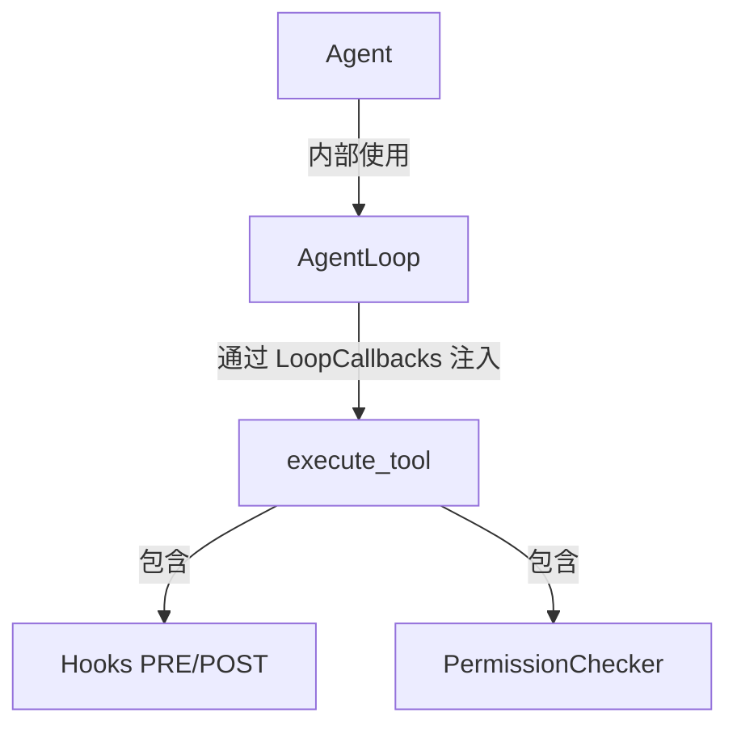

# 选择正确的抽象层：Agent、AgentLoop 与 Hooks

llm-harness 提供了三层抽象。本文帮助你根据需求选择正确的层。

---

## 三层抽象



| 层 | 职责 | 何时用 |
|---|------|--------|
| **Agent** | 一站式入口。会话、记忆合并、并发控制、`process(msg)` | 开箱即用的场景 |
| **AgentLoop** | 纯 ReAct 骨架。全部行为通过 `LoopCallbacks` 注入 | 需要自定义循环行为 |
| **Hooks** | 工具执行前后的拦截器 | 横切关注点（审计、通知、安全检查） |

---

## Agent vs AgentLoop

### 用 Agent 当

- 需要会话持久化、记忆合并、并发控制
- 需要 `InboundMessage → OutboundMessage` 的标准通道接口
- 需要流式输出和工具进度提示，但不自定义循环逻辑

```python
agent = Agent(
    harness,
    model="gpt-4o",
    on_stream=lambda delta: print(delta, end=""),
    on_progress=lambda hint, _: print(f"\n-- {hint} --"),
)
result = await agent.process(msg)
```

### 用 AgentLoop 当

- 需要自定义循环终止条件、干预每次迭代、动态修改工具列表
- 需要 `ask_user` 回调进行循环内用户交互
- 不需要会话/记忆模块，只需纯粹的 ReAct

```python
callbacks = LoopCallbacks(
    build_messages=my_build,
    execute_tool=my_execute,
    get_tool_definitions=my_defs,
    on_stream=my_stream,
)

loop = AgentLoop(provider=provider, callbacks=callbacks)
result = await loop.process_direct("任务描述")
```

### 对比

| 能力 | Agent | AgentLoop |
|------|-------|-----------|
| `on_stream` / `on_progress` | ✅ v0.2.0+ | ✅ |
| `on_event` / `on_stream_end` | ✅ v0.2.0+ | ✅ |
| `ask_user` | ✅ v0.2.0+ | ✅ |
| 会话持久化 | ✅ 自动 | ❌ 需手动 |
| 记忆合并 | ✅ 自动 | ❌ 需手动 |
| 并发控制 | ✅ 自动 | ❌ 需手动 |
| 通道集成 (`process(msg)`) | ✅ | ❌ |
| 自定义循环逻辑 | ❌ | ✅ |

---

## Hooks 能解决什么

Hooks 面向**横切关注点**——不需要改变循环行为，但需要在工具执行前后插入逻辑。

### 典型场景

| 场景 | 类型 | 示例 |
|------|------|------|
| 执行前安全审查 | Command | `python3 scripts/check.sh $ARGUMENTS` |
| 操作审计日志 | HTTP | POST 到内部审计系统 |
| 结果通知 | HTTP | 推送到 Slack/飞书 |
| LLM 快速判断 | Prompt | "此操作是否安全？" |
| LLM 深度推理 | Agent | 多步推理后决定是否放行 |

```json
{
  "pre_tool_use": [
    {
      "type": "command",
      "command": "python3 audit.py $ARGUMENTS",
      "matcher": "exec",
      "timeout_seconds": 10
    },
    {
      "type": "prompt",
      "prompt": "以下工具调用是否可能泄露敏感信息？$ARGUMENTS",
      "matcher": "write_file",
      "block_on_failure": true
    }
  ]
}
```

### Hooks 不擅长的

| 需求 | 为什么 Hooks 不行 | 正确方案 |
|------|------------------|---------|
| 流式输出 LLM 文本增量 | 流式发生在 LLM 调用内部，Hooks 不参与 | `Agent(on_stream=...)` |
| 工具开始时的进度提示 | 没有对应事件可订阅 | `Agent(on_progress=...)` |
| 自定义循环终止条件 | Hooks 只能阻断单个工具，不能终止循环 | `AgentLoop` |
| 动态修改工具列表 | Hooks 在工具调用后触发 | `LoopCallbacks.get_tool_definitions` |
| 获取 token 用量 | Hooks 不参与 LLM 调用 | `Agent(on_event=...)` |

---

## 决策流程

```
需要什么？
  ├─ 流式输出 / 进度提示       → Agent(on_stream=..., on_progress=...)
  ├─ 自定义循环控制流          → AgentLoop + LoopCallbacks
  ├─ 工具执行前后插入逻辑       → Hooks (Command / HTTP / Prompt / Agent)
  │    ├─ 阻断执行             → block_on_failure: true
  │    └─ 旁路观察             → block_on_failure: false
  └─ 开箱即用的完整管线        → Agent
```

---

## 管线中的位置

一次工具调用的完整经过：

```
Agent.process(msg)
  └─ AgentLoop.run_react_loop()
       ├─ LLM 调用 ──→ on_stream(delta)         ← 流式文本增量
       ├─ 决定调用工具
       │    └─ execute_tool()
       │         ├─ Permission.check()            ← 粗粒度门禁
       │         ├─ Hook(PRE_TOOL_USE)            ← 钩子：前置拦截
       │         ├─ Tool.execute()                ← 实际执行
       │         └─ Hook(POST_TOOL_USE)           ← 钩子：后置审计
       └─ LLM 返回最终文本
            └─ on_stream_end(resuming=False)
```
